# Convolutional Autoencoder for Spectral–Spatial Hyperspectral Unmixing

## 线性混合光谱模型 LMM(Linear mixing model)

参考：[高光谱遥感 原理、技术与应用.童庆禧 张兵 郑兰芬编著.高等教育出版社](https://ss.zhizhen.com/detail_38502727e7500f266bcf87befb91286a0ec30826f0d5e6681921b0a3ea25510134114c969f2eae5c46d827fd16ff83d4cdacdf48f85a5afad7ae4646ad63b0cc07a17234dce20b1b5d891e50a87c47bf?) 第6章 混合光谱理论与光谱分解

遥感器获取的光谱信号以像元为单位，是其对应的地表物质光谱信号的综合。受到遥感空间分辨力的限制，一个像元可能包含不止一种土地覆盖类型，形成混合像元(mixed pixel)。

混合像元形成主要有三个原因：

* 单一成分物质的光谱、几何结构、及在像元中的分布
* 大气传输过程中的混合效应
* 遥感仪器本身的混合效应

后两个为非线性效应，可通过大气纠正、仪器校准等方法克服，此处的混合光谱模型主要解决第一个原因。


给定假设：高光谱图像中的每个像元都可以近似认为是图像中各个端元（endmember）的线性混合。得到线性光谱混合模型如下：

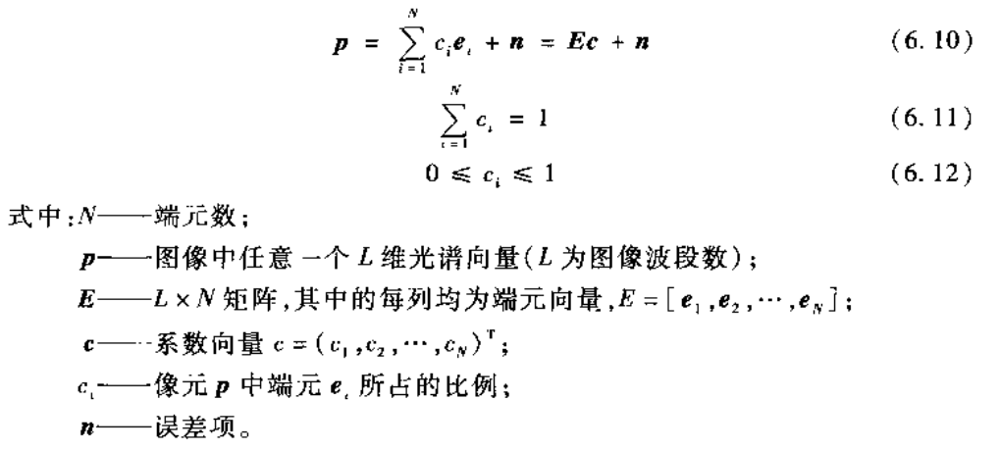

线性解混就是在已知所有端元的情况下求出每个图像像元中各个端元所占的比例，从而得到反映每个端元在图像中分布情况的比例系数图。

线性光谱混合模型的矩阵表示如下：（A为端元光谱矩阵 endmember matrix，B为各端元光谱丰度 endmember abundance）

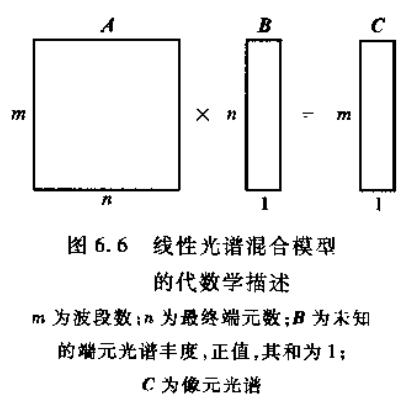

线性光谱解混主要由两个步骤构成：

* 端元提取：提取“纯”地物的光谱
* 混合像元分解：用端元的线性组合来表示混合像元


## CNNAEU（CNN autoencoder unmixing）

paper：[Convolutional Autoencoder for Spectral–Spatial Hyperspectral Unmixing | IEEE Journals & Magazine | IEEE Xplore](https://ieeexplore.ieee.org/document/9096565)

对于HU（hypterspectral unmixing）任务，大多数方法只利用了光谱信息（spectral information），未利用空间信息（spatial information）。但光谱图像与其他自然图像相同，每个像素与领域像素高度相关。提出了使用CNN的autoencoder模型，同时利用空间和光谱信息进行解混（spectral-spatial method）。

### Notation

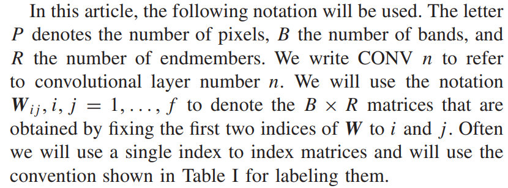

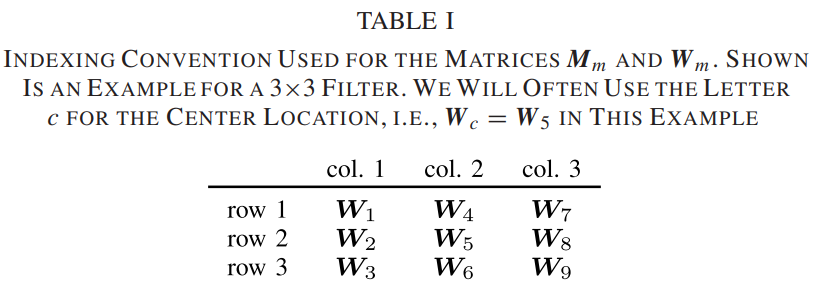

### Problem formulation and model

提出的spectral-spatial model形式如下：


上式中：

* 第一项反映spectra information。Sp是长度为R的向量，每个值属于[0,1]且求和为1。M为BXR的矩阵，列向量对应一个端元的光谱信息。
* 第二项反映spatial informaton。求和符号内M与S的乘积表明位置i对于点p光谱的贡献，i的使用如上面的TABLE 1所示。i取值范围覆盖点p的fXf非空领域，且f为奇数。
* 第三项为noise。

对于此问题，求解目标为上式中的 endmember matrix M 以及每个像元对应的abundances Sp。

通过一个CNN autoencoder，学习输入的低维特征表示（size不变，通道数降低至端元数R），经过softmax后（符合sum-to-one条件）视作R个端元的丰度图，同时将decoder采用kernel size为fXf的卷积（线性激活，符合LMM），将通道数变回输入的谱带数B，学习到的权重即视作矩阵M。

具体模型如下图所示：

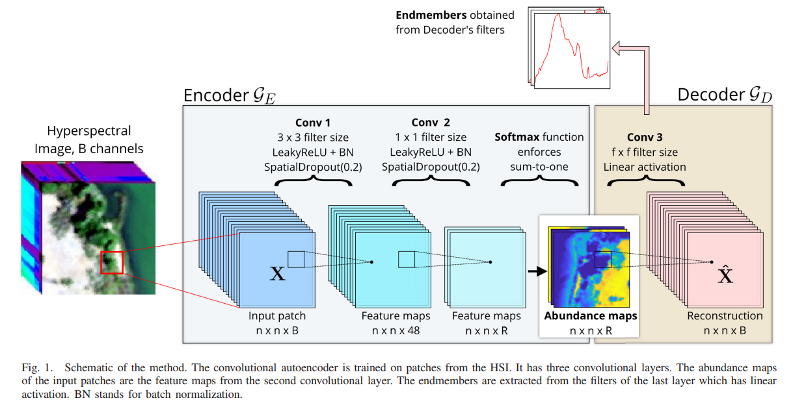

其中Abundance maps通道i上的像素点的值对应该像元中端元i所占的比例。而最后一层网络的权重与上文spectral-spatial model中矩阵的对应关系大致如下：

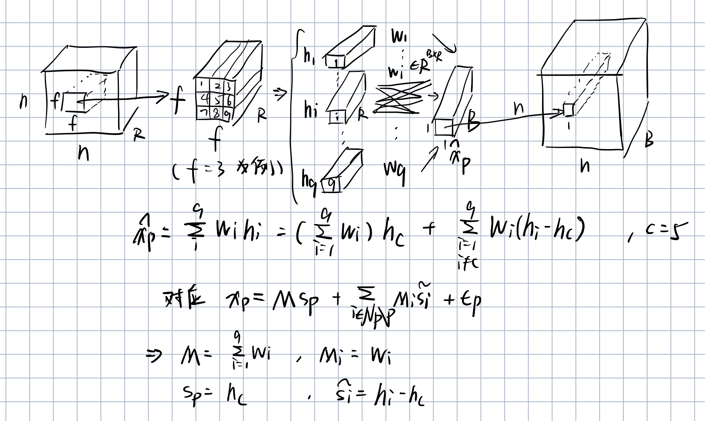

为了衡量autoencoder输入输出的相似性，使用了 the spectral angle distance(SAD) ，对于每一个像元有：


对单个patch：


因此总的损失函数为N个patch求和：


此loss只衡量了两向量方向的相似性，与尺度信息无关(sclae invariant)，对于端元提取效果好，但混合像元分解即求解丰度图效果并非最佳。同时由于使用了batch normalization、learkyReLU以及softmax，丰度图中的值倾向于0或1。

> ​	This loss, although very good for endmember extraction, is not an optimal metric for data reconstruction since it is scale invariant. It is possible that SAD loss leads to **higher variance in the abundance estimation** than is explainable by considering only the variance in the quality of the extracted endmembers. Still, methods using SAD loss can achieve fairly good results for abundance estimation as the results of the MTAEU method demonstrate.(paper Ⅲ.Experiments A.Methodolody and Performance Metrics)
>
> ​	The quality of extracted endmembers weighs more heavily in our evaluation of the method than the quality of the abundance maps. This is because **the abundance maps** produced by our method tend to be very **binary**, that is abundances are either very low or very high, almost like classification maps. This happens because of batch normalization and the fact that we are using a ReLU like activation and the softmax function to enforce the ASC constraint.(paper Ⅲ.Experiments A.Methodolody and Performance Metrics)

对于此问题，可以使用上述模型用于提取端元，再用另一个的autoencoder（decoder的权重固定为上一模型得到的端元矩阵，不适用batch normalization）进行训练得到新的丰度图。(model CNNAEU2)

> As was mentioned at the start of this section, the abundance maps produced by CNNAEU are very intense looking, that is both very **sparse and binary**. It is possible to extend the method so it **refines the abundance maps after extracting the endmembers**. This could be done using an autoencoder in serial with the unmixing one, which has **its decoder’s weights set to be the extracted endmember matrix and made nontrainable so they are fixed, and does not use batch normalization layers**. By training it for a few epochs, it will produce abundance maps which are not nearly as binary looking.(paper Ⅲ.Experiments F.Abundance Maps)

## Dataset

### Samson

Samson dataset来源：[Data - rslab (ut.ac.ir)](https://rslab.ut.ac.ir/data)

读取samson_1.mat，可得到训练数据如下：

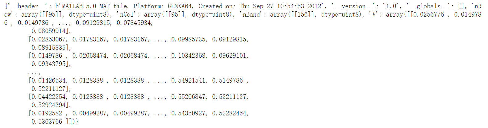

'V'对应shape为(156, 9025)的训练数据

读取end3.mat，可得到标签如下：

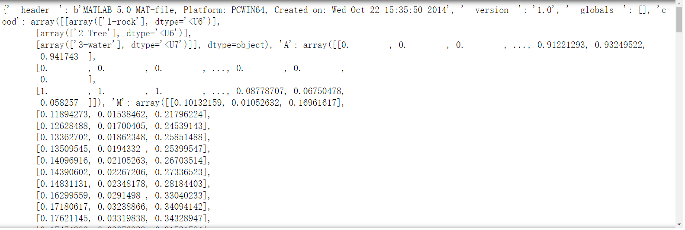

其中，‘A’对应shape为(3, 9025)的abundance map，‘M'对应shape为(156, 3)的reference endmembers

## Code

参考：[dv-fenix/HyperspecAE: Code for the experiments on the Samson Dataset as presented in the paper: Hyperspectral Unmixing Using a Neural Network Autoencoder (Palsson et al. 2018) (github.com)](https://github.com/dv-fenix/HyperspecAE)

#### Samson Dataset

模型输入图片的大小为(40,40)，训练图片的大小为(95,95)，将数据读入后，对训练图片随机裁剪成num_samples个大小为(40,40)的子图，作为训练数据。

```python
'''输入图片和label（均为tensor），返回随机剪裁后的结果'''
def rand_crop(image, label, height, width):
    """随机裁剪特征和标签图像"""
    rect = torchvision.transforms.RandomCrop.get_params(
        image, (height, width))
    image = torchvision.transforms.functional.crop(image, *rect)
    label = torchvision.transforms.functional.crop(label, *rect)
    return image, label


class SamsonDataset(torch.utils.data.Dataset):
    
    img_folder = './Data_Matlab/'
    gt_folder = './GroundTruth/'
    training_file = 'samson_1.mat'
    labels_file = 'end3.mat'
    
    def __init__(self, root='./', num_samples=40, crop_size=(40,40)):
        super(SamsonDataset, self).__init__()
        self.root = root
        self.num_samples = num_samples    #生成的(40,40)样本数目
        self.crop_size = crop_size
        
        '''load data'''
        PATH = os.path.join(self.root, self.img_folder, self.training_file)
        PATH_L = os.path.join(self.root, self.gt_folder, self.labels_file)
        train_data = scipy.io.loadmat(PATH)
        labels = scipy.io.loadmat(PATH_L)
        
        '''preprocess'''
        rows = train_data['nRow'].item()   #95
        cols = train_data['nCol'].item()   #95
        bands = train_data['nBand'].item()  #156
        
        train_data = train_data['V'].T   #train image (9025, 156)
        labels = labels['A'].T    # abundance map(9025, 3)
        
        train_data = train_data.reshape(rows,cols,-1)  #(95,95,156)
        labels = labels.reshape(rows,cols,-1)   #(95,95,3)
        assert train_data.shape[-1]==bands,"trian data shape error"
        train_data_tensor = torch.from_numpy(train_data).permute(2,0,1)   #转换成tensor (156,95,95)
        labels_tensor = torch.from_numpy(labels).permute(2,0,1)     #(3,95,95)
        train_data_tensor = self.normalize_data(train_data_tensor)   # image normalization
        
        self.data_list, self.label_list = self.get_croped_data(train_data_tensor, labels_tensor, self.crop_size, self.num_samples)
        
        print(f"create {len(self.data_list)} data")
    
    def normalize_data(self,train_data_tensor):   #normalization
        return train_data_tensor / 255
    
    def get_croped_data(self,train_data_tensor, labels_tensor, crop_size, num_samples):   # create data samples
        data_list, label_list = [], []
        for i in range(num_samples):
            croped_train_data,croped_label = rand_crop(train_data_tensor, labels_tensor, *crop_size)
            data_list.append(croped_train_data)
            label_list.append(croped_label)
            
        return data_list,label_list
    
    def __len__(self):
        return len(self.data_list)
    
    def __getitem__(self, idx):
        return self.data_list[idx], self.label_list[idx]
```

#### Model

与paper中模型的超参数保持一致，模型返回的结果包括encode和decode，其中encode用于得到abundance map，decode用于和输入一起求loss。

```python
class Scale(nn.Module):
    '''scale before softmax'''
    def __init__(self, scale_rate=3.5):
        super(Scale, self).__init__()
        self.scale_rate = scale_rate
        
    def forward(self, input):
        return input * self.scale_rate
    
class CNNAE(nn.Module):
    def __init__(self, num_bands=156, dropout=0.2, hidden_c=48, num_endmembers=3, f=11, scale_rate=3.5):
        super(CNNAE, self).__init__()
        self.act = nn.LeakyReLU()
        self.dropout = nn.Dropout2d(dropout)
        self.asc = nn.Softmax(dim=1)
        self.scale = Scale(scale_rate)
        self.BN1 = nn.BatchNorm2d(hidden_c)
        self.BN2 = nn.BatchNorm2d(num_endmembers)
        
        self.encoder = nn.Sequential(OrderedDict([
            ('Conv_1', nn.Conv2d(num_bands, hidden_c, kernel_size=3, padding=1, bias=False, padding_mode='reflect')),
            ('activation_1', self.act),
            ('BatchNormalization_1', self.BN1),
            ('Dropout_1',self.dropout),
            ('Conv_2', nn.Conv2d(hidden_c, num_endmembers, kernel_size=1, bias=False, padding_mode='reflect')),
            ('activation_2', self.act),
            ('BatchNormalization_2', self.BN2),
            ('Dropout_2', self.dropout),
            ('Scale', self.scale),
            ('ASC', self.asc)
        ]))
        
        self.decoder = nn.Sequential(OrderedDict([
            ('Conv_3', nn.Conv2d(num_endmembers, num_bands, kernel_size=f, padding=int((f-1)/2), bias=False, padding_mode='reflect'))
        ]))
        
    
    def forward(self, input):
        encode = self.encoder(input)
        decode = self.decoder(encode)
        return encode, decode
    
def init_weight(m):
    if isinstance(m, nn.Conv2d):
        nn.init.kaiming_uniform_(m.weight.data,nonlinearity='relu')
        if m.bias is not None:
            nn.init.constant_(m.bias.data, 0)
    elif isinstance(m, nn.BatchNorm2d):
        nn.init.constant_(m.weight.data, 1)
        nn.init.constant_(m.bias.data, 0)
```

#### SAD loss（the spectral angle distance）

在测试时发现，当input和target相同时，loss的输出可能会出现nan。解决办法为把arccos的输入clamp到[-1+1e-6,1-1e-6]区间内。

```python
class SAD(nn.Module):
    def __init__(self, batch_size, num_bands=156, eps=1e-6):
        super(SAD, self).__init__()
        self.num_bands = num_bands
        self.batch_size = batch_size
        self.eps = eps
        
    def forward(self, input, target):
        try:
            input_norm = torch.sqrt(torch.bmm(input.view(self.batch_size,1,-1), input.view(self.batch_size,-1,1)))
            target_norm = torch.sqrt(torch.bmm(target.view(self.batch_size,1,-1), target.view(self.batch_size,-1,1)))
            summation = torch.bmm(input.view(self.batch_size,1,-1), target.view(self.batch_size,-1,1))
            angle = torch.arccos( torch.clamp((summation+self.eps) / (input_norm*target_norm+self.eps),min=-1+self.eps ,max=1-self.eps) ) #clamp否则会出现nan


        except ValueError:
            return 0.0
        
        return angle
```

#### train

```python
def train(model, train_iter, num_epochs, device, criterion, num_samples):
    model.to(device)
    model.train()
    
    for epoch in range(num_epochs):
        print(f'Epoch: {epoch:^5d}/{num_epochs-1:^5d}')
        print("----------------------------------------------")
        total_loss = 0
        
        for i,(X,_) in enumerate(tqdm(train_iter)):
            X = X.to(device).float()
            optimizer.zero_grad()
            _,reconstruction = model(X)
            loss = criterion(X,reconstruction).sum()
#             print(loss)
            with torch.autograd.set_detect_anomaly(True):
                loss.backward()
            optimizer.step()
            
            total_loss += loss
            
        print(f'average loss:{total_loss/num_samples}')
        
        
batch_size, num_epochs, num_samples = 32, 150, 320
Samson_Dataset = SamsonDataset(num_samples=num_samples)
train_iter = torch.utils.data.DataLoader(Samson_Dataset, batch_size=batch_size, shuffle=True)

model = CNNAE()
model.apply(init_weight)
device = 'cuda' if torch.cuda.is_available() else 'cpu'
print(device)
model.to(device)

criterion = SAD(batch_size)
optimizer = torch.optim.RMSprop(model.parameters(), lr=0.0003)

train(model, train_iter, num_epochs, device, criterion, num_samples)
```

#### extract endmember and predict abundance map

endmember结果矩阵在model.decoder.Conv_3.weight中

```python
extract_endmembers = model.decoder.Conv_3.weight.permute(1,2,3,0)

bands = np.arange(0,156,1)
fig = plt.figure(figsize=(15, 5))
for i in range(3):
    tmp = extract_endmembers[i].reshape((-1,156)).sum(dim=0)
    tmp = tmp / tmp.max()
    fig.add_subplot(1, 3, i+1)
    plt.plot(bands, np.array(tmp.cpu().detach()), 'b')
```


虽然训练时模型输入图片大小为(40,40)，但由于模型是全卷积神经网络，在预测时并不限制输入图片的大小，直接将完整的图片输入到网络，得到的decode即对应预测的abundance map。

```python
model = CNNAE()
model.load_state_dict(torch.load('./model/CNNAEU_8_bad.pth'))
model.to('cpu')
model.eval()
'''读取输入图片'''
img_folder = './Data_Matlab/'
training_file = 'samson_1.mat'
PATH = os.path.join(img_folder, training_file)
train_data = scipy.io.loadmat(PATH)
image = train_data['V'].T.reshape(95,95,156)   #原图像(95,95,156)
image_tensor = torch.from_numpy(image)
image_tensor = image_tensor.permute(2,0,1).unsqueeze(0)   #torch.Size([1, 156, 95, 95])

predict_abundance,_ = model(image_tensor.float())
predict_abundance = predict_abundance[0]

'''visualization'''
fig = plt.figure(figsize=(15, 5))
for i in range(3):
    fig.add_subplot(1, 3, i+1)
    plt.imshow(predict_abundance[i].detach().T)
    plt.axis('off')
plt.show()
```

#### Evaluation

对于得到的extract endmember以及predict abundance map先通过绘图的方式人工匹配。

对于endmembers求mSAD：

```python
'''endmembers comparison'''
num_endmembers = 3

sad = 0
for i in range(num_endmembers):
    m = torch.from_numpy(endmembers[i] / endmembers[i].max() ).float()
    n = extract_endmembers_list[i].float()
    m_norm = torch.sqrt(torch.bmm(m.view(1,1,-1), m.view(1,-1,1)))
    n_norm = torch.sqrt(torch.bmm(n.view(1,1,-1), n.view(1,-1,1)))
    summation = torch.bmm(m.view(1,1,-1), n.view(1,-1,1))
    angle = torch.arccos( summation / (m_norm*n_norm) )
    print(f"angle of {endmember_list[i]}:{angle.item()}")
    sad += angle

msad = sad / num_endmembers
print(f"msad:{msad.item()}")
```

对于abundance map求MSE

```python
sum_square = 0
for i in range(num_endmembers):
    m = torch.from_numpy(abundance[i])
    n = predict_abundance[order[i]].view(9025)
    square = torch.sum(torch.square(n-m))
    print(f"sum of square of {endmember_list[i]} :{square.item()}")
    sum_square += square.item()
    
mse = sum_square / num_endmembers    
print(f"mse :{mse}")
```

## Result

### good result

使用 lr=0.0003, batch_size=32, num_epochs=150,  num_samples=320，进行了若干次训练，通过人眼观察筛选出的较好的结果如下：

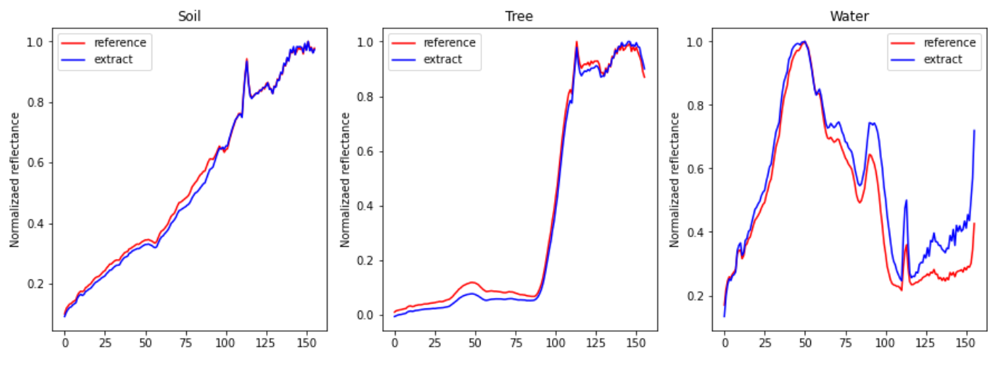

其对应的evaluation merics为：

```
angle of Soil:0.025727154687047005
angle of Tree:0.046676620841026306
angle of Water:0.11302526295185089
msad:0.06180967763066292
```

Water的评价指标明显大于soil和tree，与图片相符。

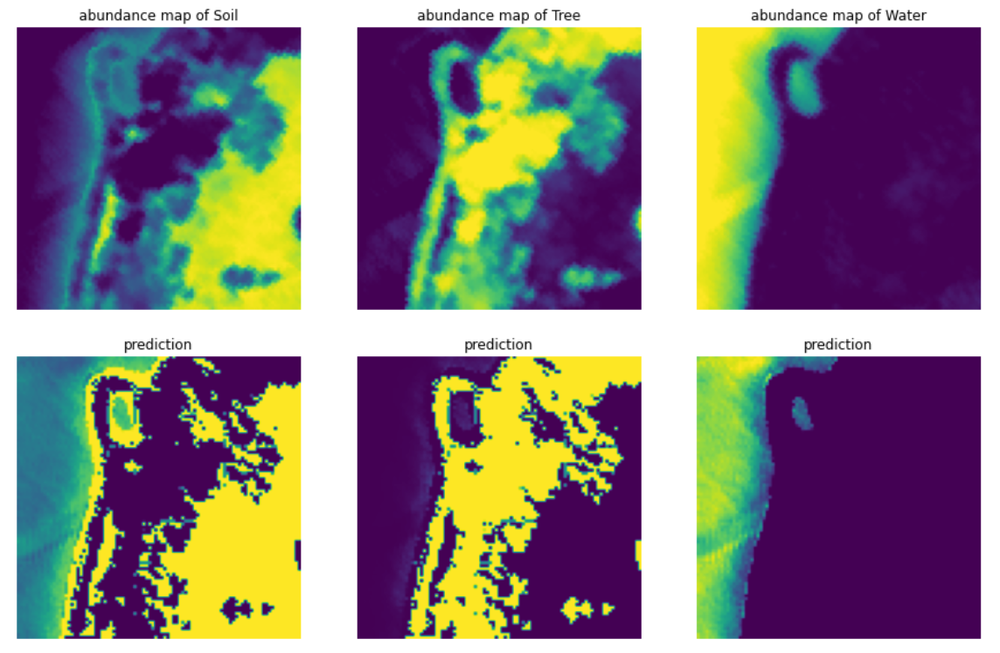

其对应的evaluation merics为：

```
sum of square of Soil :965.2618817250168
sum of square of Tree :531.1082583732455
sum of square of Water :424.46746451485603
mse :640.2792015377062
```

从图片中可以看出，得到的abundance map倾向于二值分布（大部分数值接近1或0），不够平滑，这一点与paper中相符（尚未实现CNNAEU2）

### bad result

经过若干次训练，发现模型并不容易收敛到较好的位置。训练得到结果不好的模型如下：

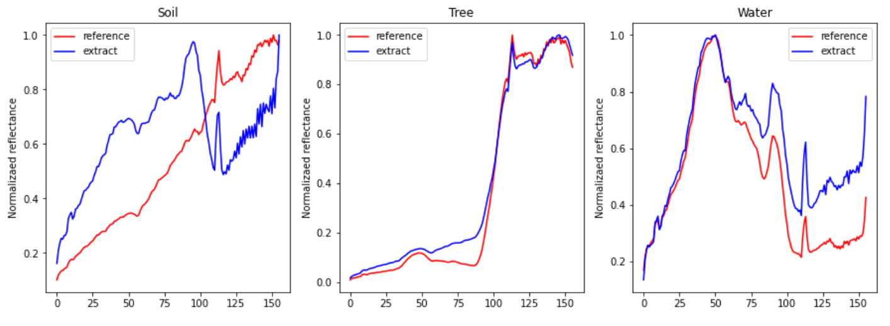

```
angle of Soil:0.4087604284286499
angle of Tree:0.08812235295772552
angle of Water:0.19395649433135986
msad:0.23027975857257843
```

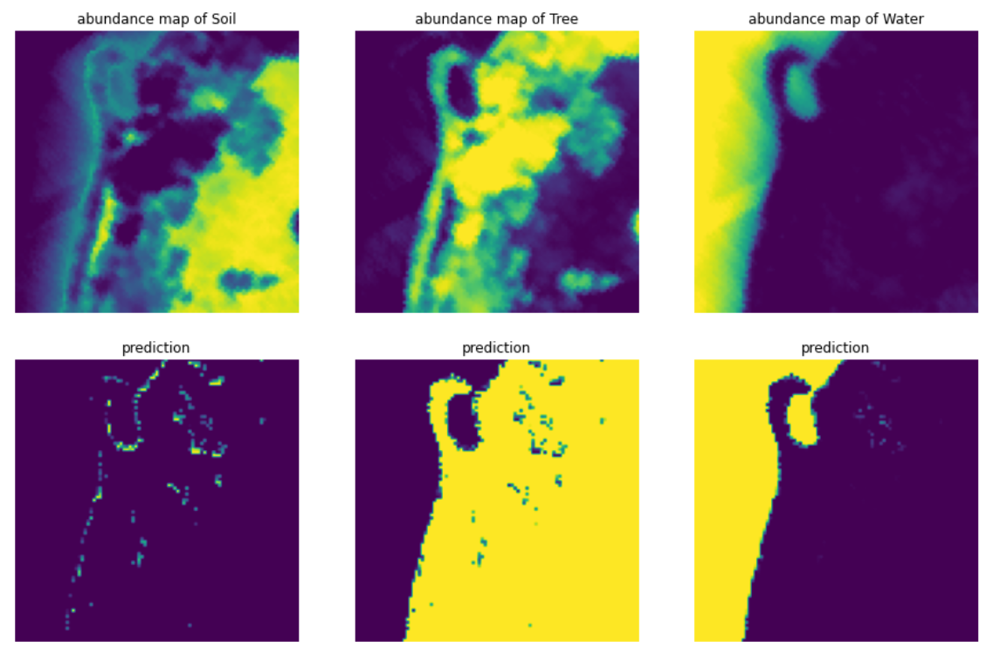

```
sum of square of Soil :2442.8258309917533
sum of square of Tree :2392.0287991938662
sum of square of Water :194.11314193475943
mse :1676.3225907067929
```


## Reference

* [高光谱遥感 原理、技术与应用.童庆禧 张兵 郑兰芬编著.高等教育出版社](https://ss.zhizhen.com/detail_38502727e7500f266bcf87befb91286a0ec30826f0d5e6681921b0a3ea25510134114c969f2eae5c46d827fd16ff83d4cdacdf48f85a5afad7ae4646ad63b0cc07a17234dce20b1b5d891e50a87c47bf?)
* [Convolutional Autoencoder for Spectral–Spatial Hyperspectral Unmixing | IEEE Journals & Magazine | IEEE Xplore](https://ieeexplore.ieee.org/document/9096565)
* [dv-fenix/HyperspecAE: Code for the experiments on the Samson Dataset as presented in the paper: Hyperspectral Unmixing Using a Neural Network Autoencoder (Palsson et al. 2018) (github.com)](https://github.com/dv-fenix/HyperspecAE)

