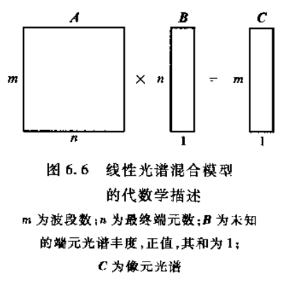

# Convolutional Autoencoder for Spectral–Spatial Hyperspectral Unmixing

## 线性混合光谱模型

参考：《高光谱遥感——原理、技术与应用》 第6章 混合光谱理论与光谱分解

遥感器获取的光谱信号以像元为单位，是其对应的地表物质光谱信号的综合。受到遥感空间分辨力的限制，一个像元可能包含不止一种土地覆盖类型，形成混合像元(mixed pixel)。

混合像元形成主要有三个原因：

* 单一成分物质的光谱、几何结构、及在像元中的分布
* 大气传输过程中的混合效应
* 遥感仪器本身的混合效应

后两个为非线性效应，可通过大气纠正、仪器校准等方法克服，此处的混合光谱模型主要解决第一个原因。

给定假设：高光谱图像中的每个像元都可以近似认为是图像中各个端元（endmember）的线性混合。得到线性光谱混合模型如下：

线性解混就是在已知所有端元的情况下求出每个图像像元中各个端元所占的比例，从而得到反映每个端元在图像中分布情况的比例系数图。

线性光谱混合模型的矩阵表示如下：（A为端元光谱矩阵 endmember matrix，B为各端元光谱丰度 endmember abundance）

线性光谱解混主要由两个步骤构成：

* 端元提取：提取“纯”地物的光谱
* 混合像元分解：用端元的线性组合来表示混合像元

## Reference

* [高光谱遥感 原理、技术与应用.童庆禧 张兵 郑兰芬编著.高等教育出版社](https://ss.zhizhen.com/detail_38502727e7500f266bcf87befb91286a0ec30826f0d5e6681921b0a3ea25510134114c969f2eae5c46d827fd16ff83d4cdacdf48f85a5afad7ae4646ad63b0cc07a17234dce20b1b5d891e50a87c47bf?)
* [Convolutional Autoencoder for Spectral–Spatial Hyperspectral Unmixing | IEEE Journals & Magazine | IEEE Xplore](https://ieeexplore.ieee.org/document/9096565)

