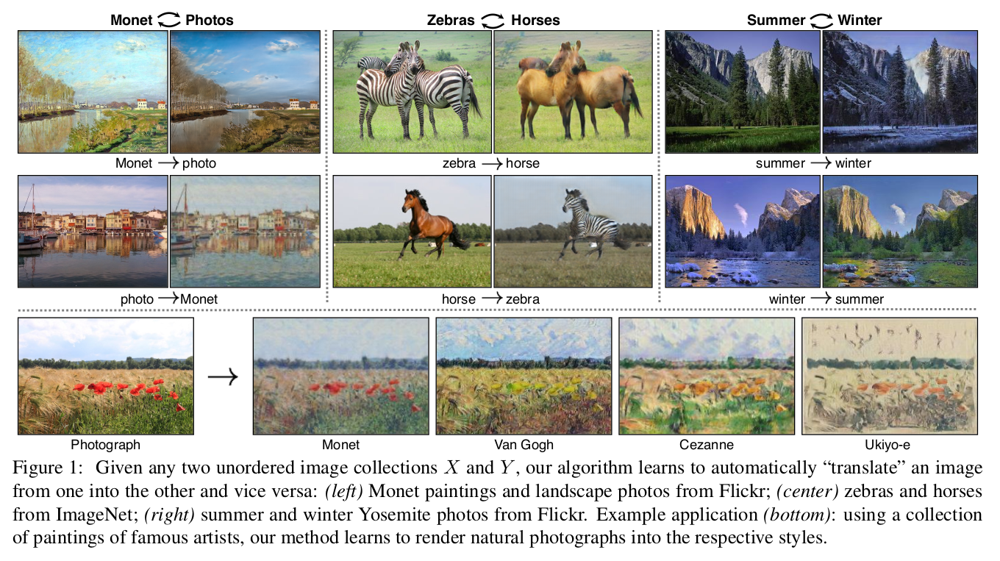
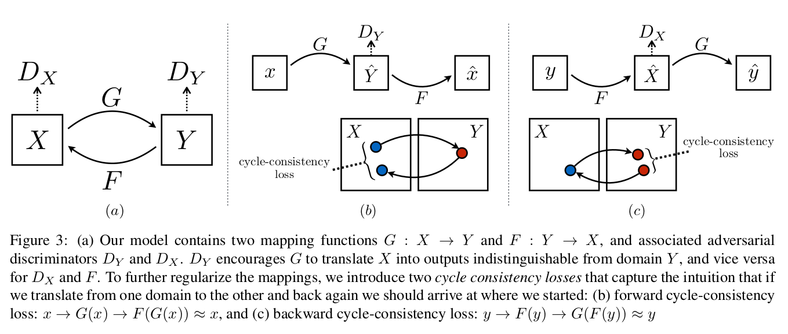
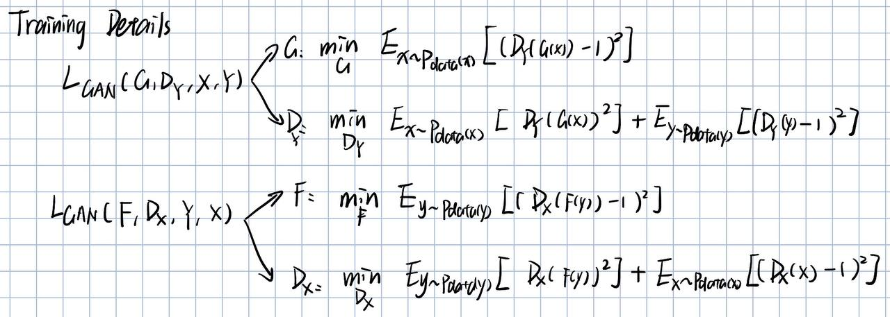
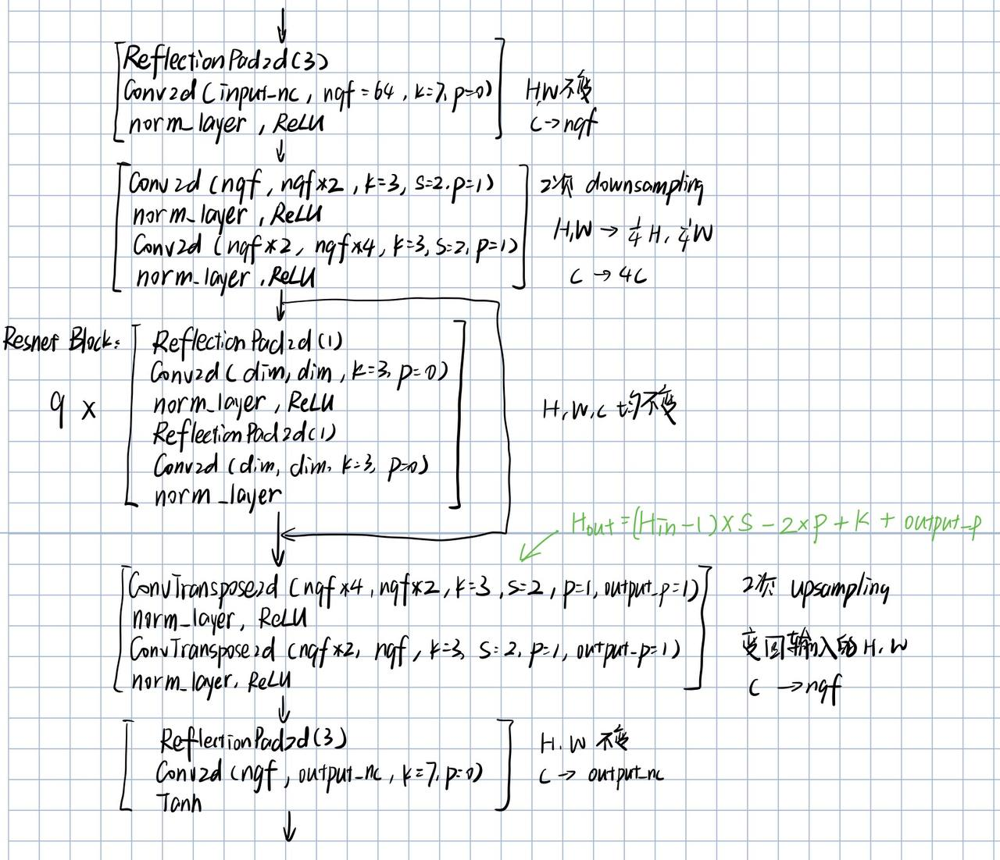
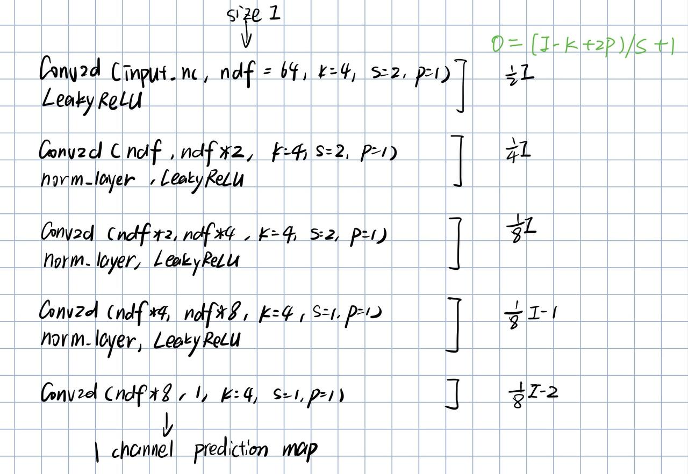

# CycleGAN for style transfer

## Reference

* [Unpaired Image-to-Image Translation using Cycle-Consistent Adversarial Networks](https://arxiv.org/pdf/1703.10593v7.pdf)
* https://github.com/junyanz/pytorch-CycleGAN-and-pix2pix

## CycleGAN概述



GAN模型由Generator和Discriminator两个网络模型组成，在unconditional GAN中，G输入random noise输出图片，D用于区分图片来源于G还是数据集，两者对抗学习，最终期望G可以生成与数据集中图片无法区分开的图片。

在image translation任务中，则是给定domain X、Y，期望G将X映射至与Y接近的分布。但在仅仅使用 the adversarial objective 的情况下，往往会出现许多x映射到同样的y的情况，从而失去的模型的多样性。

> However, such a translation does not guarantee that an individual input x and output y are paired up in a meaningful way – there are infinitely many mappings G that will induce the same distribution over ŷ. Moreover, in practice,we have found it **difficult to optimize the adversarial objective in isolation**: standard procedures often lead to the well-known problem of **mode collapse**, where all input images map to the same output image and the optimization fails to make progress .(paper introduction paragraph 6)

为解决这个问题，CycleGAN引入了“cycle consistent”，引入F为Y到X的映射，期望X由G映射到Y再由F映射回来后保持不变，基于此得到“cycle consistency loss”



因此loss由 adversarial loss 和 cycle consistency loss 两部分组成。

adversarial loss 和GAN中一致（F映射的loss形式相同）


cycle consistency loss 如下


因此完整的loss如下


特别地，在 Photo generation from paintings (见5.2 Applications)任务中，为了保持生成前后的图片色彩构成的一致性，引入了 identity loss，如下


在实现中，对于adversarial loss，使用均方误差代替了log。

> we replace the negative log likelihood objective by a least-squares loss [35]. This loss is more stable during training and generates higher quality results.(paper 4.Implementation training details)



在模型方面，G由若干卷积层和residual blocks构成。D使用了70X70 Patch GANs。

> For the discriminator networks we use 70 × 70 PatchGANs [22, 30, 29], which aim to classify whether 70 × 70 overlapping image patches are real or fake. Such a patch-level discriminator architecture has fewer parameters than a full-image discriminator and can work on arbitrarily-sized images in a fully convolutional fashion.(paper 4.Implementation Network Architecture)

## Code

源码源自：https://github.com/junyanz/pytorch-CycleGAN-and-pix2pix

### Generator Model



```python
'''in cycle_gan_model.py---class CycleGANModel(BaseModel)---__init__'''
self.netG_A = networks.define_G(opt.input_nc, opt.output_nc, opt.ngf, opt.netG, opt.norm,not opt.no_dropout, opt.init_type, opt.init_gain, self.gpu_ids)
self.netG_B = networks.define_G(opt.output_nc, opt.input_nc, opt.ngf, opt.netG, opt.norm,not opt.no_dropout, opt.init_type, opt.init_gain, self.gpu_ids)

'''in networks.py---define_G(...)'''
net = None
norm_layer = get_norm_layer(norm_type=norm)

if netG == 'resnet_9blocks':
    net = ResnetGenerator(input_nc, output_nc, ngf, norm_layer=norm_layer, 							use_dropout=use_dropout, n_blocks=9)
    
return init_net(net, init_type, init_gain, gpu_ids)  # net to gpu and init weights


'''in nerwork.py---Class ResnetGenerator(nn.Module)---__init__(...)'''
model = [nn.ReflectionPad2d(3),
         nn.Conv2d(input_nc, ngf, kernel_size=7, padding=0, bias=use_bias),
         norm_layer(ngf),
         nn.ReLU(True)]

n_downsampling = 2
for i in range(n_downsampling):  # add downsampling layers
    mult = 2 ** i
    model += [nn.Conv2d(ngf * mult, ngf * mult * 2, kernel_size=3, stride=2, padding=1, bias=use_bias),
              norm_layer(ngf * mult * 2),
              nn.ReLU(True)]

mult = 2 ** n_downsampling
for i in range(n_blocks):       # add ResNet blocks
	model += [ResnetBlock(ngf * mult, padding_type=padding_type, norm_layer=norm_layer, use_dropout=use_dropout, use_bias=use_bias)]

for i in range(n_downsampling):  # add upsampling layers
    mult = 2 ** (n_downsampling - i)
    model += [nn.ConvTranspose2d(ngf * mult, int(ngf * mult / 2),
                                 kernel_size=3, stride=2,
                                 padding=1, output_padding=1,
                                 bias=use_bias),
              norm_layer(int(ngf * mult / 2)),
              nn.ReLU(True)]
    model += [nn.ReflectionPad2d(3)]
    model += [nn.Conv2d(ngf, output_nc, kernel_size=7, padding=0)]
    model += [nn.Tanh()]

self.model = nn.Sequential(*model)

'''in network.py---class ResnetBlock(nn.Module)---__init__(...)'''
super(ResnetBlock, self).__init__()
self.conv_block = self.build_conv_block(dim, padding_type, norm_layer, use_dropout, use_bias)

'''in network.py---class ResnetBlock(nn.Module)---build_conv_block(...)'''
conv_block = []
p = 0
if padding_type == 'reflect':
    conv_block += [nn.ReflectionPad2d(1)]
elif padding_type == 'replicate':
    conv_block += [nn.ReplicationPad2d(1)]
elif padding_type == 'zero':
    p = 1
else:
    raise NotImplementedError('padding [%s] is not implemented' % padding_type)

conv_block += [nn.Conv2d(dim, dim, kernel_size=3, padding=p, bias=use_bias), norm_layer(dim), nn.ReLU(True)]
if use_dropout:
    conv_block += [nn.Dropout(0.5)]

p = 0
if padding_type == 'reflect':
    conv_block += [nn.ReflectionPad2d(1)]
elif padding_type == 'replicate':
    conv_block += [nn.ReplicationPad2d(1)] 
elif padding_type == 'zero':
    p = 1
else:
    raise NotImplementedError('padding [%s] is not implemented' % padding_type)
conv_block += [nn.Conv2d(dim, dim, kernel_size=3, padding=p, bias=use_bias), norm_layer(dim)]

return nn.Sequential(*conv_block)
    
'''in network.py---class ResnetBlock(nn.Module)---forward()'''
def forward(self, x):
    """Forward function (with skip connections)"""
    out = x + self.conv_block(x)  # add skip connections
    return out
    
```

### Discriminator

通过五层卷积实现，前四层实现downsampling，并逐渐增加通道数，最后一层使用1x1卷积将通道数变1，最后生成一个prediction map，里面的每个元素对应原始图片的一个区域，且相邻元素对应的区域之间存在重叠。



```python
'''in cycle_gan_model.py---class CycleGANModel(BaseModel)---__init__'''
if self.isTrain:  # define discriminators
    self.netD_A = networks.define_D(opt.output_nc, opt.ndf, opt.netD,
                                    opt.n_layers_D, opt.norm, opt.init_type, opt.init_gain, self.gpu_ids)
    self.netD_B = networks.define_D(opt.input_nc, opt.ndf, opt.netD,
                                    opt.n_layers_D, opt.norm, opt.init_type, opt.init_gain, self.gpu_ids)
    
    
'''in network.py---define_D(...)'''
net = None
norm_layer = get_norm_layer(norm_type=norm)

if netD == 'basic':  # default PatchGAN classifier
    net = NLayerDiscriminator(input_nc, ndf, n_layers=3, norm_layer=norm_layer)
    
    
'''in network.py---class NLayerDiscriminator(nn.Module)---'''
class NLayerDiscriminator(nn.Module):
	"""Defines a PatchGAN discriminator"""

    def __init__(self, input_nc, ndf=64, n_layers=3, norm_layer=nn.BatchNorm2d):
        """Construct a PatchGAN discriminator

        Parameters:
            input_nc (int)  -- the number of channels in input images
            ndf (int)       -- the number of filters in the last conv layer
            n_layers (int)  -- the number of conv layers in the discriminator
            norm_layer      -- normalization layer
        """
        super(NLayerDiscriminator, self).__init__()
        if type(norm_layer) == functools.partial:  # no need to use bias as BatchNorm2d has affine parameters
            use_bias = norm_layer.func == nn.InstanceNorm2d
        else:
            use_bias = norm_layer == nn.InstanceNorm2d

        kw = 4
        padw = 1
        sequence = [nn.Conv2d(input_nc, ndf, kernel_size=kw, stride=2, padding=padw), nn.LeakyReLU(0.2, True)]
        nf_mult = 1
        nf_mult_prev = 1
        for n in range(1, n_layers):  # gradually increase the number of filters
            nf_mult_prev = nf_mult
            nf_mult = min(2 ** n, 8)
            sequence += [
                nn.Conv2d(ndf * nf_mult_prev, ndf * nf_mult, kernel_size=kw, stride=2, padding=padw, bias=use_bias),
                norm_layer(ndf * nf_mult),
                nn.LeakyReLU(0.2, True)
            ]

        nf_mult_prev = nf_mult
        nf_mult = min(2 ** n_layers, 8)
        sequence += [
            nn.Conv2d(ndf * nf_mult_prev, ndf * nf_mult, kernel_size=kw, stride=1, padding=padw, bias=use_bias),
            norm_layer(ndf * nf_mult),
            nn.LeakyReLU(0.2, True)
        ]

        sequence += [nn.Conv2d(ndf * nf_mult, 1, kernel_size=kw, stride=1, padding=padw)]  # output 1 channel prediction map
        self.model = nn.Sequential(*sequence)

    def forward(self, input):
        """Standard forward."""
        return self.model(input)

```

### CycleGAN model Class 其余method

需要注意的是与GAN中相同，在计算D的Adversarial loss时需要将G生成的fake_image detach。从而反向传播时不会影响到G。

```python
def set_input(self, input):
    """Unpack input data from the dataloader and perform necessary pre-processing steps.

        Parameters:
            input (dict): include the data itself and its metadata information.

        The option 'direction' can be used to swap domain A and domain B.
        """
    AtoB = self.opt.direction == 'AtoB'
    self.real_A = input['A' if AtoB else 'B'].to(self.device)
    self.real_B = input['B' if AtoB else 'A'].to(self.device)
    self.image_paths = input['A_paths' if AtoB else 'B_paths']
    
    
def forward(self):
    """Run forward pass; called by both functions <optimize_parameters> and <test>."""
    self.fake_B = self.netG_A(self.real_A)  # G_A(A)
    self.rec_A = self.netG_B(self.fake_B)   # G_B(G_A(A))
    self.fake_A = self.netG_B(self.real_B)  # G_B(B)
    self.rec_B = self.netG_A(self.fake_A)   # G_A(G_B(B))
    
    
def backward_D_basic(self, netD, real, fake):
    """Calculate GAN loss for the discriminator

        Parameters:
            netD (network)      -- the discriminator D
            real (tensor array) -- real images
            fake (tensor array) -- images generated by a generator

        Return the discriminator loss.
        We also call loss_D.backward() to calculate the gradients.
        """
    # Real
    pred_real = netD(real)
    loss_D_real = self.criterionGAN(pred_real, True)
    # Fake
    pred_fake = netD(fake.detach())    #detach 使反向传播的时候不会影响到G
    loss_D_fake = self.criterionGAN(pred_fake, False)
    # Combined loss and calculate gradients
    loss_D = (loss_D_real + loss_D_fake) * 0.5
    loss_D.backward()
    return loss_D


def backward_D_A(self):
    """Calculate GAN loss for discriminator D_A"""
    fake_B = self.fake_B_pool.query(self.fake_B)
    self.loss_D_A = self.backward_D_basic(self.netD_A, self.real_B, fake_B)

def backward_D_B(self):
    """Calculate GAN loss for discriminator D_B"""
    fake_A = self.fake_A_pool.query(self.fake_A)
    self.loss_D_B = self.backward_D_basic(self.netD_B, self.real_A, fake_A)
    
    
def backward_G(self):
    """Calculate the loss for generators G_A and G_B"""
    lambda_idt = self.opt.lambda_identity
    lambda_A = self.opt.lambda_A
    lambda_B = self.opt.lambda_B
    # Identity loss
    if lambda_idt > 0:
        # G_A should be identity if real_B is fed: ||G_A(B) - B||
        self.idt_A = self.netG_A(self.real_B)
        self.loss_idt_A = self.criterionIdt(self.idt_A, self.real_B) * lambda_B * lambda_idt
        # G_B should be identity if real_A is fed: ||G_B(A) - A||
        self.idt_B = self.netG_B(self.real_A)
        self.loss_idt_B = self.criterionIdt(self.idt_B, self.real_A) * lambda_A * lambda_idt
    else:
        self.loss_idt_A = 0
        self.loss_idt_B = 0

        # GAN loss D_A(G_A(A))
        self.loss_G_A = self.criterionGAN(self.netD_A(self.fake_B), True)
        # GAN loss D_B(G_B(B))
        self.loss_G_B = self.criterionGAN(self.netD_B(self.fake_A), True)
        # Forward cycle loss || G_B(G_A(A)) - A||
        self.loss_cycle_A = self.criterionCycle(self.rec_A, self.real_A) * lambda_A
        # Backward cycle loss || G_A(G_B(B)) - B||
        self.loss_cycle_B = self.criterionCycle(self.rec_B, self.real_B) * lambda_B
        # combined loss and calculate gradients
        self.loss_G = self.loss_G_A + self.loss_G_B + self.loss_cycle_A + self.loss_cycle_B + self.loss_idt_A +self.loss_idt_B
        self.loss_G.backward()
        
        
def optimize_parameters(self):
    """Calculate losses, gradients, and update network weights; called in every training iteration"""
    # forward
    self.forward()      # compute fake images and reconstruction images.
    # G_A and G_B
    self.set_requires_grad([self.netD_A, self.netD_B], False)  # Ds require no gradients when optimizing Gs
    self.optimizer_G.zero_grad()  # set G_A and G_B's gradients to zero
    self.backward_G()             # calculate gradients for G_A and G_B
    self.optimizer_G.step()       # update G_A and G_B's weights
    # D_A and D_B
    self.set_requires_grad([self.netD_A, self.netD_B], True)
    self.optimizer_D.zero_grad()   # set D_A and D_B's gradients to zero
    self.backward_D_A()      # calculate gradients for D_A
    self.backward_D_B()      # calculate graidents for D_B
    self.optimizer_D.step()  # update D_A and D_B's weights
```

### loss

(具体计算在上文 CycleGAN model Class 其余method 中)

#### Adversarial loss

gan_mode=vanilla时使用cross entropy（和paper中最初给的损失函数相同）

gan_mode=lsgan(default)时，使用MSE(paper中指明使用MSE效果更好）

给定gan_mode进行init，在计算损失时，由于prediction为一张图，先将给定的标签(1 or 0)expand到prediction图片的大小，然后两者计算均方误差

```python
'''in cycle_gan_model.py---class CycleGANModel(BaseModel)---__init__'''
self.criterionGAN = networks.GANLoss(opt.gan_mode).to(self.device)  # define GAN loss.

'''in network.py---class GANLoss(nn.Module)'''
class GANLoss(nn.Module):
    """Define different GAN objectives.

    The GANLoss class abstracts away the need to create the target label tensor
    that has the same size as the input.
    """

    def __init__(self, gan_mode, target_real_label=1.0, target_fake_label=0.0):
        """ Initialize the GANLoss class.

        Parameters:
            gan_mode (str) - - the type of GAN objective. It currently supports vanilla, lsgan, and wgangp.
            target_real_label (bool) - - label for a real image
            target_fake_label (bool) - - label of a fake image

        Note: Do not use sigmoid as the last layer of Discriminator.
        LSGAN needs no sigmoid. vanilla GANs will handle it with BCEWithLogitsLoss.
        """
        super(GANLoss, self).__init__()
        self.register_buffer('real_label', torch.tensor(target_real_label))
        self.register_buffer('fake_label', torch.tensor(target_fake_label))
        self.gan_mode = gan_mode
        if gan_mode == 'lsgan':
            self.loss = nn.MSELoss()
        elif gan_mode == 'vanilla':
            self.loss = nn.BCEWithLogitsLoss()
        elif gan_mode in ['wgangp']:
            self.loss = None
        else:
            raise NotImplementedError('gan mode %s not implemented' % gan_mode)

    def get_target_tensor(self, prediction, target_is_real):
        """Create label tensors with the same size as the input.

        Parameters:
            prediction (tensor) - - tpyically the prediction from a discriminator
            target_is_real (bool) - - if the ground truth label is for real images or fake images

        Returns:
            A label tensor filled with ground truth label, and with the size of the input
        """

        if target_is_real:
            target_tensor = self.real_label
        else:
            target_tensor = self.fake_label
        return target_tensor.expand_as(prediction)

    def __call__(self, prediction, target_is_real):
        """Calculate loss given Discriminator's output and grount truth labels.

        Parameters:
            prediction (tensor) - - tpyically the prediction output from a discriminator
            target_is_real (bool) - - if the ground truth label is for real images or fake images

        Returns:
            the calculated loss.
        """
        if self.gan_mode in ['lsgan', 'vanilla']:
            target_tensor = self.get_target_tensor(prediction, target_is_real)
            loss = self.loss(prediction, target_tensor)
        elif self.gan_mode == 'wgangp':
            if target_is_real:
                loss = -prediction.mean()
            else:
                loss = prediction.mean()
        return loss
```

#### Cycle loss 和 Identity loss

两者均为L1 loss

```python
'''in cycle_gan_model.py---class CycleGANModel(BaseModel)---__init__'''
self.criterionCycle = torch.nn.L1Loss()
self.criterionIdt = torch.nn.L1Loss()
```


