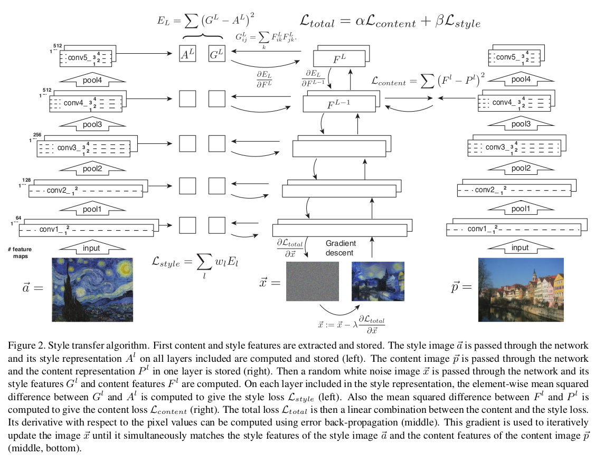

# relate models

## A Neural Algorithm of Artistic Style

Reference:https://openaccess.thecvf.com/content_cvpr_2016/papers/Gatys_Image_Style_Transfer_CVPR_2016_paper.pdf

Assumption: Deep CNN能够从图片中提取 style representation 和 content representation，并且两者能够较好的分开。

给定两张图片，一张提供内容信息，一张提供风格信息，使用卷积神经网络分别提取内容和风格的特征表示，将两者“融合”用于产生新图片。在实际操作中，将 content representation 和 style representation 的 loss 加权和作为优化目标，将新图片初始化为白噪音，通过梯度下降算法优化得到目标图片。

### Content representation

认为应用于 object recognition 任务的卷积神经网络（如paper中使用的VGG）中间的卷积层按层级提取了图片的内容信息，随着层数增加，卷积层中间结果中像素级的细节逐渐丢失，而高层次的图像内容信息得到保留（extract high-level semantic information）。

对于第L层卷积层，假设有个filters，输出特征图的size为,这一次的输出即可存放在一个矩阵 中。

为了得到第L层卷积层输出结果所对应的内容信息，初始化网络输入为白噪音，形状和原始图片相同，计算得到第L层卷积层输出，将其和目标图片第L层卷积层输出之间计算MSE，得到 content loss：

通过梯度下降求解，最终收敛得到第L层卷积输出对应的内容图片：

其中F小于0时，偏导数为0，是因为激活函数为ReLU。

### Style representation

在深度卷积神经网络中，每层卷积层输出通常具有多通道，将第L层卷积输出中的一个通道拉伸成一个向量，个向量两两对应求内积，可得到一个Gram矩阵，其中 ，认为该矩阵中包含了图片的风格信息。

> By including the feature correlations of multiple layers, we obtain a stationary, multi-scale representation of the input image, which captures its texture information but not the global arrangement.(paper 2.2 Style representation)

与content representation的方法相同，可以得到MSE：

将多个卷积层的损失加权和可以得到 style loss：

同样的通过梯度下降求解：

### Style transfer

同时对新图片考虑 content representation 以及 style representation，将 content loss 和 style loss 加权和得到总loss：

通过梯度下降算法即可求解，具体模型如下图所示：

