#  Generative Adversarial Nets

## Reference

* [Generative Adversarial Nets (nips.cc)](https://papers.nips.cc/paper/2014/file/5ca3e9b122f61f8f06494c97b1afccf3-Paper.pdf)

* [PyTorch-GAN/gan.py at master · eriklindernoren/PyTorch-GAN (github.com)](https://github.com/eriklindernoren/PyTorch-GAN/blob/master/implementations/gan/gan.py)

## GAN概述

> We propose a new framework for estimating generative models via an adversarial process, in which we simultaneously train **two models**: **a generative model G** that captures the data distribution, and **a discriminative model D** that estimates the probability that a sample came from the training data rather than G. The training procedure for G is to maximize the probability of D making a mistake. This framework corresponds to a minimax two-player game. In the space of arbitrary functions G and D, a unique solution exists, with G recovering the training data distribution and D equal to 1/2 everywhere. (paper abstract)

​	模型包含两个网络，一个生成器G，一个判别器D，均为MLP结构。给定图片数据集，G输入 random noise 输出图片，D输入图片输出一个位于[0,1]的标量，表明输入图片来自数据集(而非G生成)的概率。在训练过程中G尽可能使得 D(gen_images) 高，而D则尽可能使 D(real_images) 高 D(gen_images) 低。最终期望D无法分辨图片是来自G还是原始数据集，即G生成的数据分布与原始数据集数据分布相同。

## CODE

源码参考：[PyTorch-GAN/gan.py at master · eriklindernoren/PyTorch-GAN (github.com)](https://github.com/eriklindernoren/PyTorch-GAN/blob/master/implementations/gan/gan.py)

###  G与D网络结构

```python
class Generator(nn.Module):
    def __init__(self):
        super(Generator, self).__init__()

        def block(in_feat, out_feat, normalize=True):
            layers = [nn.Linear(in_feat, out_feat)]
            if normalize:
                layers.append(nn.BatchNorm1d(out_feat, 0.8))
            layers.append(nn.LeakyReLU(0.2, inplace=True))    # LeakyReLU(x)=max(0,x)+negative_slope∗min(0,x)  inplace计算结果覆盖原tensor
            return layers

        self.model = nn.Sequential(
            *block(opt.latent_dim, 128, normalize=False),
            *block(128, 256),
            *block(256, 512),
            *block(512, 1024),
            nn.Linear(1024, int(np.prod(img_shape))),   # np.prod() Return the product of array elements over a given axis
            nn.Tanh()    #最终输出范围[-1,1]，即归一化后的像素点取值范围
        )

    def forward(self, z):
        img = self.model(z)
        img = img.view(img.size(0), *img_shape)    # reshape tensor to (batch_size,C,H,W)
        return img
```


```python
class Discriminator(nn.Module):
    def __init__(self):
        super(Discriminator, self).__init__()

        self.model = nn.Sequential(
            nn.Linear(int(np.prod(img_shape)), 512),
            nn.LeakyReLU(0.2, inplace=True),
            nn.Linear(512, 256),
            nn.LeakyReLU(0.2, inplace=True),
            nn.Linear(256, 1),
            nn.Sigmoid(),
        )

    def forward(self, img):
        img_flat = img.view(img.size(0), -1)
        validity = self.model(img_flat)

        return validity
```


### loss

paper中给出的loss如下：


在实际应用中，在训练初期，G生成图片效果很差，因此D能很好的判别，即$D(G(z))$很小，那么$log(1-D(G(z)))$则会饱和，可以通过 代替。

```python
adversarial_loss = torch.nn.BCELoss()    # measures the Binary Cross Entropy between the target and the input probabilities

g_loss = adversarial_loss(discriminator(gen_imgs), valid)

real_loss = adversarial_loss(discriminator(real_imgs), valid)
fake_loss = adversarial_loss(discriminator(gen_imgs.detach()), fake)   # detach 不让d_loss反传到G
d_loss = (real_loss + fake_loss) / 2
```

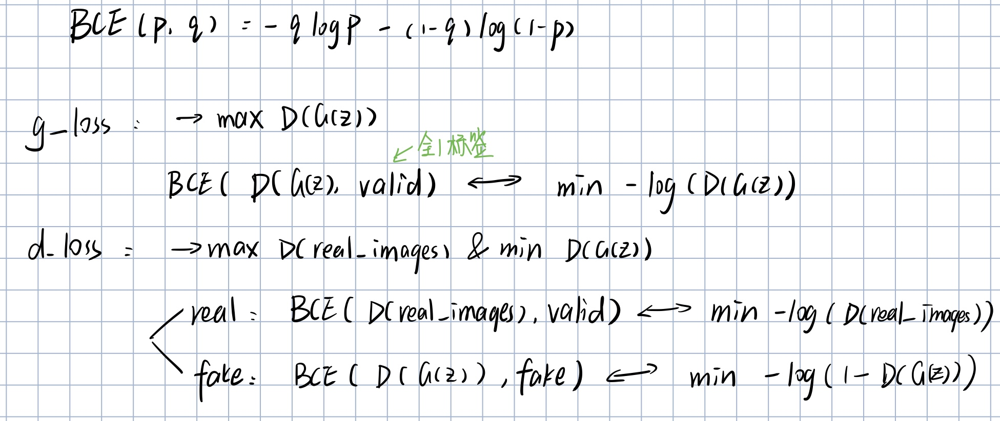

需要注意的是，计算d_loss时需要将G detach，使得反向传播的不会传播到G，否则训练数据集的信息将直接流向G

> Adversarial models may also gain some statistical advantage from the generator network **not being updated directly** with data examples, but only with gradients flowing through the discriminator. This means that **components of the input are not copied directly into the generator’s parameters**.(Paper中Advantages and disadvantages小节的第二段)

###  训练过程

训练过程中交替训练D与G，在伪代码中每个iteration先训练了k步D，再训练一步G，原因是只有D具有一定的分辨能力，G才能学到数据集的分布信息。(否则许多z会生成相同的能过骗过D的x，因而丧失了模型的多样性)（在CODE中并没有使用paper中的k步D一步G，而是每个iteration先更新一次G，后更新一次D）

> Instead, we alternate between k steps of optimizing D and one step of optimizing G. This results in D being maintained near its optimal solution, so long as G changes slowly enough.(paper中Adversarial nets小节的第二段)
>
> in particular, **G must not be trained too much without updating D**, in order to avoid “the Helvetica scenario” in which **G collapses too many values of z to the same value of x to have enough diversity** to model $p_{data}$ (paper中Advantages and disadvantages小节的第一段)

伪代码如下：

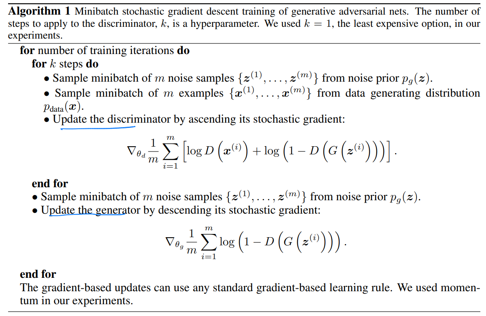

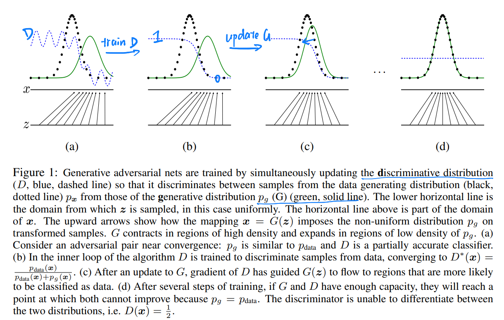

```python
# -----------------
#  Train Generator
# -----------------

optimizer_G.zero_grad()

# Sample noise as generator input
z = Variable(Tensor(np.random.normal(0, 1, (imgs.shape[0], opt.latent_dim))))

# Generate a batch of images
gen_imgs = generator(z)

# Loss measures generator's ability to fool the discriminator
g_loss = adversarial_loss(discriminator(gen_imgs), valid)

g_loss.backward()
optimizer_G.step()

# ---------------------
#  Train Discriminator
# ---------------------

optimizer_D.zero_grad()

# Measure discriminator's ability to classify real from generated samples
real_loss = adversarial_loss(discriminator(real_imgs), valid)
fake_loss = adversarial_loss(discriminator(gen_imgs.detach()), fake)   # detach 不让d_loss反传到G
d_loss = (real_loss + fake_loss) / 2

d_loss.backward()
optimizer_D.step()
```


## Result

训练过程中G生成的部分图片按顺序如下（从左往右，从上往下顺序）

<center class="half">
    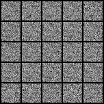
    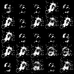
    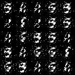
    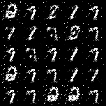
    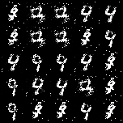
    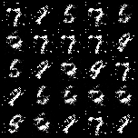
    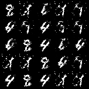
    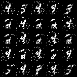
    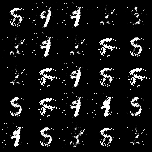
    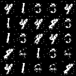
    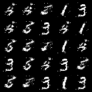
    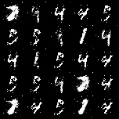
    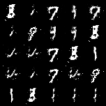
    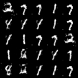
    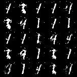
    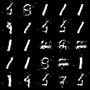
    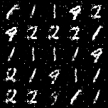
    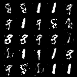
    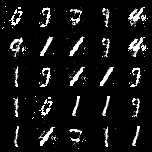
</center>


从结果看，能够生成部分类似数字，但并没有达到paper中的效果，而且训练到后期，数字1出现的频率明显高于其他数字，可能出现了 *G collapses too many values of z to the same value of x* 的情况
