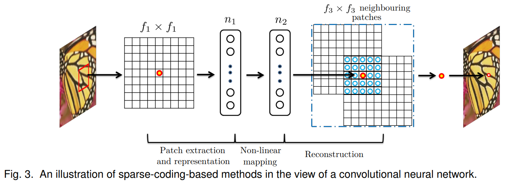
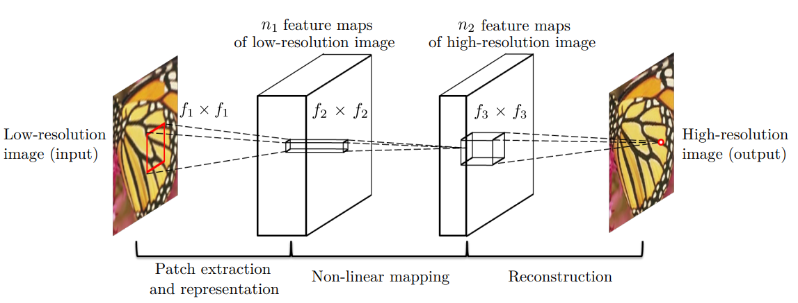

# Super-Resolution CNN

## SR algorithm

图像超分辨率算法可分为四种类型：prediction models, edge based methods, image statistical methods and patch based (or example-based) methods。其中 example-based methods表现较好。其又可分为 internal example-based methods 以及 external example-based methods。

> * The internal example-based methods exploit the self-similarity property and generate exemplar patches from the input image.
>
> * The external example-based methods learn **a mapping between low/high resolution patches** from external datasets. These studies vary on **how to learn a compact dictionary or manifold space** to relate low/high-resolution patches, and on **how representation schemes can be conducted in such spaces**.(Paper 2 Related Work 2.1 Image Super-Resolution)

### The sparse-coding-based methods

The sparse-coding-based methods 是external example-based SR methods中具有代表性的方法。

其主要包含以下步骤：(Paper 1 Intorduction)

> * **Patch extraction and representation**: overlapping patches are densely cropped from the input image and pre-processed (e.g.,subtracting mean and normalization).These patches are then encoded by a low-resolution dictionary.
> * **Non-linear mapping**: The sparse coefficients are passed into a high-resolution dictionary for reconstructing high-resolution patches.
> * **Reconstruction**: The overlapping reconstructed patches are aggregated (e.g., by weighted averaging) to produce the final output.

此方法的优化目标为上面提及的dictionaries以及 low-resolution dictionary 到 high-resolution dictionary 的映射函数。

模型结构图如下：



* 对于原图中得到的f1Xf1大小的patch，通过 the sparse coding solver 投影到 low-resolution dictionary，得到一个长度为n1的向量。（等价于用n1个f1Xf1卷积核在原图上卷积）
* 通过迭代算法，输入n1个系数，经过非线性映射，输出得到n2个系数（通常n2=n1），得到的向量即为 high-resolution patch的特征表示。（等价于用1x1卷积核）
* 把n2个系数投影到 high-resolution dictionary，生成 high-resolution patch。对于重叠的区域进行平均化处理。（等价于f3Xf3卷积核的线性卷积）

### SRCNN

发现 The sparse-coding-based methods 的每一步都可以通过卷积运算实现，并且在第二步的映射中，从n1系数得到n2系数需要迭代求解，而在CNN中只需一次前向传播，速度更快；同时CNN可以实现端到端模型，更加简便。基于此，提出了SRCNN。

将图片先经过双线性插值法上采样到期望的大小。



上图中三步骤对应的数学表达式如下：

* 

* 
* 

其中W1对应n1个f1Xf1大小卷积核的卷积运算，W2，W3同理。B对应偏置项。

传统的方法通常都是基于单通道的，但SRCNN只需要将输出层卷积核个数设置为3，即可直接实现RGB图像的超分。

loss选择MSE：


## Code

参考：[GuoPingPan/DeepLearing-Unet-SRCNN: The project is aiming to use Unet to deal with MSRCv2 Dataset and SRCNN to deal with BSDS500. (github.com)](https://github.com/GuoPingPan/DeepLearing-Unet-SRCNN)

### dataset

* 训练集中包含的图像共300张,视作标签图像(ground truth),共有两种尺寸:(481,321)或(321,481),读取的时候舍去最后一行和最后一列,并且对于高大于宽的图片进行90度翻转,使得所有训练图片size相同.
* 训练图像:对标签图像进行步长为2的采样,得到低分辨率的图片,再进行双线性插值upscale到原始尺寸作为网络的输入

```python
class BSDS500_Dataset(torch.utils.data.Dataset):
    def __init__(self, img_dir):
        super(BSDS500_Dataset, self).__init__()
        self.img_dir = img_dir
        self.img_path = glob.glob1(img_dir,'*.jpg')
        
    
    def __len__(self):
        return len(self.img_path)
    
    def __getitem__(self, idx):
        im_Y = cv2.imread(os.path.join(self.img_dir,self.img_path[idx]))[:-1,:-1,[2,1,0]]
        
        h_y,w_y,_ = im_Y.shape
        if h_y>w_y:
            im_Y = np.rot90(im_Y).copy()    #高大于宽的图片进行逆时针90度旋转
        
        im_X = im_Y[::2,::2].copy()  #获得原始的训练image(未双线性插值upscale)  切片方式[开始：结束：步长]，其中开始和结束可省略 
        h,w,_ = im_X.shape
        im_bic = cv2.resize(im_X, (2*w,2*h), interpolation=cv2.INTER_CUBIC)   #双线性插值upscale 得到网络输入
        
        X = torch.from_numpy(im_bic).permute(2,0,1).float() / 255.0
        Y = torch.from_numpy(im_Y).permute(2,0,1).float() / 255.0
        
        return X,Y
```

### model

```python
class SRCNN(nn.Module):
    def __init__(self,in_channels=3):
        super(SRCNN, self).__init__()

        self.patch_extraction = nn.Conv2d(in_channels=in_channels,out_channels=64,kernel_size=9,padding=4)
        self.non_linear_mapping = nn.Conv2d(in_channels=64,out_channels=32,kernel_size=1)
        self.reconstruction = nn.Conv2d(in_channels=32,out_channels=in_channels,kernel_size=5,padding=2)

        self.relu = nn.ReLU(inplace=True)

    def forward(self,x):
        output = self.relu(self.patch_extraction(x))
        output = self.relu(self.non_linear_mapping(output))
        output = self.reconstruction(output)

        return output
```


## Reference

* [Image Super-Resolution Using Deep Convolutional Networks 1501.00092v3.pdf (arxiv.org)](https://arxiv.org/pdf/1501.00092v3.pdf)
* [GuoPingPan/DeepLearing-Unet-SRCNN: The project is aiming to use Unet to deal with MSRCv2 Dataset and SRCNN to deal with BSDS500. (github.com)](https://github.com/GuoPingPan/DeepLearing-Unet-SRCNN)
