# Unet

使用Unet网络模型在msrc_v2数据集上实现语义分割

## msrc_v2数据集

MSRC-V2，训练集包含 276张图像，验证集包含59张图像，测试集包含256张图象。共有21个类别，部分像素没有进行标注。

数据格式为.bmp（BitMap file）

image-gt pair示例如下：

<center class='half'>
    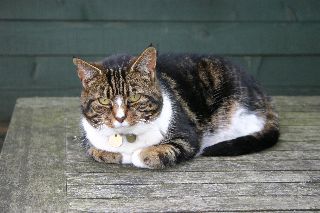
    
</center>

## Unet网络模型

对于生物医学等应用环境下的小样本图像像素级分类(语义分割)任务，面临的主要问题是局部的像素级信息(localization)和整体的语义信息的权衡。在2012年，Ciresan等人提出了运用了滑动窗口(sliding-window)的深度神经网络方法，通过提供窗口内的局部区域信息实现对单个像素的分类。此网络架构赢得了ISBI 2012年的 EM segmentation challenge。但网络存在两个主要缺陷，第一，滑动窗口的引入导致了对每个像素需要一次单独预测，同时窗口之间的大量重叠引入了计算冗余，使得运算速度慢；第二，窗口大小的选择是一个tradeoff(a trade-off between localization accuracy and the use of context)，窗口越大，定位会越不准确，但提供的上下文信息更多。

而Unet基于全卷积网络实现，网络结构如下图所示：

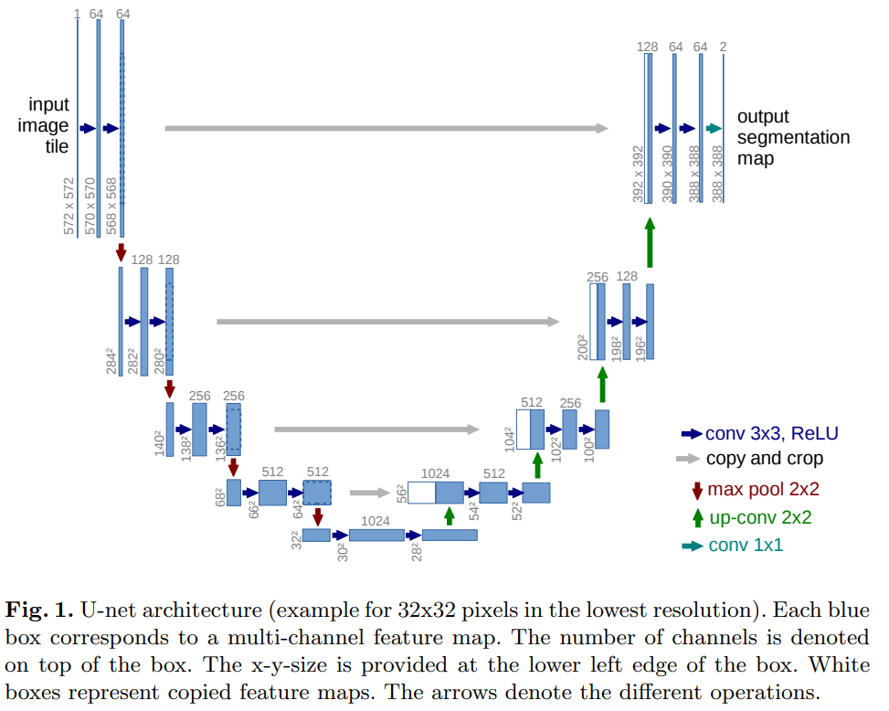

网络大致呈左右对称结构，左半部分网络通过递进的卷积和下采样提取图像的语义信息，右半部分网络通过上采样，逐层提高输出图像的分辨率，在上采样之后将左半部分网络对应下采样之前的特征图和当前的特征图进行拼接，认为此方法提供了定位信息。

> The main idea in [9] is to supplement a usual contracting network by successive layers, where pooling operators are replaced by upsampling operators. Hence, these layers increase the resolution of the output. In order to localize, high resolution features from the contracting path are combined with the upsampled output. A successive convolution layer can then learn to assemble a more precise output based on this information.(paper 1 Introduction paragraph 5)

需要注意的是在paper中：

* 网络中的卷积层不包含padding，这会导致输出结果分辨率小于输入图像，以给定一块图像，输出结果对应该图像中间某区域的分类结果。对于图像边缘的预测，通过镜像补全图像实现。
* 由于样本数量少，进行了数据增强(data argumentation)，如shift, rotation, gray value variations以及 elastic deformations(弹性变换)。弹性变换原理参考：[论文笔记：图像数据增强之弹性形变（Elastic Distortions） - 知乎 (zhihu.com)](https://zhuanlan.zhihu.com/p/46833956)
* 为了更好的划分边界，在loss中引入了权重，使得边界像素对应的权重更大。

对于此模型，paper中选用的loss为结合了pixel-wise soft-max的交叉熵。每个像素点可视作一个样本，经过softmax后单个像素的各个通道的值，即为此像素属于该通道对应类别的概率，基于此可计算每个像素点的交叉熵，在经过加权求和可得到最终的loss。

## Code

### UnetDataset

数据给出了图片对应的ground_truth，在训练时需要将其转化成label（单通道，像素值对应原像素点在color list中的下标），以及y（通道数=类别数，是label的one-hot编码）。

在定义数据集前，使用单独的模块将ground_truth转化成label并保存，以便后期读取。

```python
'''给定gt，根据color得到label。label是元素为0-22的标签图，其中0对应背景，其余依次对应21个类别'''
def gt_to_label():
    for i,gt in enumerate(tqdm(gt_path)):
        img = cv2.imread(os.path.join(gt_dir,gt))
        img = cv2.cvtColor(img, cv2.COLOR_BGR2RGB)    #cv2 interpret the channel order as BGR instead of RGB
        h,w,_ = img.shape
        mask = np.zeros((h,w),dtype=np.uint8)
        
        for j,tmp in enumerate(color):   #index:0-21, index 0 corresponds background
            mask_rgb = (img==tmp)
            mask = mask + (mask_rgb[:,:,0]*mask_rgb[:,:,1]*mask_rgb[:,:,2])*j
            
        cv2.imwrite(os.path.join(label_dir,gt_path[i]),mask)
        
        
gt_dir = './msrc2_seg/gt'
gt_path = glob.glob1(gt_dir,'*.bmp')    #list of names of gt 
label_dir = './msrc2_seg/label'
if not os.path.exists(label_dir):
    os.makedirs(label_dir)
gt_to_label()
```

由于数据集内的图片大小不一，且此问题为像素级别的分类，resize可能引入误差。因此将数据集中的图片和label一一对应的随机裁剪为相同的大小，若原始图片小于给定的crop_size，则丢弃该图片。为此定义了函数rand_crop(image, label, height, width)。

```python
'''输入图片和label（均为tensor），返回随机剪裁后的结果'''
def rand_crop(image, label, height, width):
    """随机裁剪特征和标签图像"""
    rect = torchvision.transforms.RandomCrop.get_params(
        image, (height, width))
    image = torchvision.transforms.functional.crop(image, *rect)
    label = torchvision.transforms.functional.crop(label, *rect)
    return image, label
```

定义class UnetDataset，继承于torch.utils.data.Dataset，初始化时根据给定的txt文件，读取文件内给出的image(features)以及相应的label，并转化成tensor。对于features，使其除以255，将像素值缩放到[0,1]，然后features和labels经过filter函数滤除小于给定尺寸的图片，并一一对应的rand_crop。

```python
'''读取images和labels存放在两个list中'''
def read_data(img_names, img_dir, label_dir):
    img_add, label_add = [], []
    images, labels = [], []
    
    img_add = [os.path.join( img_dir, img_name)
             for img_name in img_names]
    
    label_add = [os.path.join( label_dir, img_name[:-4] +'_GT.bmp')
          for img_name in img_names] 
    
    for i, address in enumerate(img_add):
        images.append(cv2.cvtColor(cv2.imread(address), cv2.COLOR_BGR2RGB))  
    for i,address in enumerate(label_add):
        labels.append(cv2.imread(address,cv2.IMREAD_GRAYSCALE))
    
    return images,labels


class UnetDataset(torch.utils.data.Dataset):
    def __init__(self, img_dir, data_file, label_dir, crop_size, num_classes=22):
        super(UnetDataset, self).__init__()
        
        self.img_dir = img_dir
        self.img_names = pd.read_csv(data_file).values.squeeze().tolist()   #读取txt文件中的图片名，存在list中
        self.label_dir = label_dir
        self.crop_size = crop_size
        self.num_classes = num_classes
        
        features, labels = read_data(self.img_names, self.img_dir, self.label_dir)
        features = [torch.from_numpy(item) for item in features]    #未permute(符合filter中shape要求)，在 __getitem__中permute
        labels = [torch.from_numpy(item) for item in labels]
        self.features = [self.normalize_image(feature)    
                         for feature in self.filter(features)]
        self.labels = self.filter(labels)
        
        print('read ' + str(len(self.img_names)) + ' examples')
        print('after filter, remain ' + str(len(self.features)) + ' examples')

        
        
    def __len__(self):
        return len(self.features)
        
    def normalize_image(self, img):
        return img.float() / 255
    
    def filter(self, imgs):    #过滤尺寸小于crop_size的图片
        return [img for img in imgs if (
            img.shape[0] >= self.crop_size[0] and
            img.shape[1] >= self.crop_size[1])]

    def __getitem__(self, idx):
        feature, label = rand_crop(self.features[idx].permute(2,0,1)
                                   , self.labels[idx],
                                    *self.crop_size)
        
        y = None
        temp = np.array(label)
        y =  np.array([1*(temp==i) for i in range(self.num_classes)])
        y = torch.from_numpy(y).permute(1,2,0)    # C,H,W ----> H,W,C
        
            
        return feature,label,y  #label为原始输入(通道数为1)，y为label one-hot编码后结果(通道数为22)
```

### Unet model

与paper中不同的是，在卷积层中加入了padding，使得最终输出的图片大小与输入图片大小相同，并且默认使用双线性插值法代替了转置卷积实现上采样。

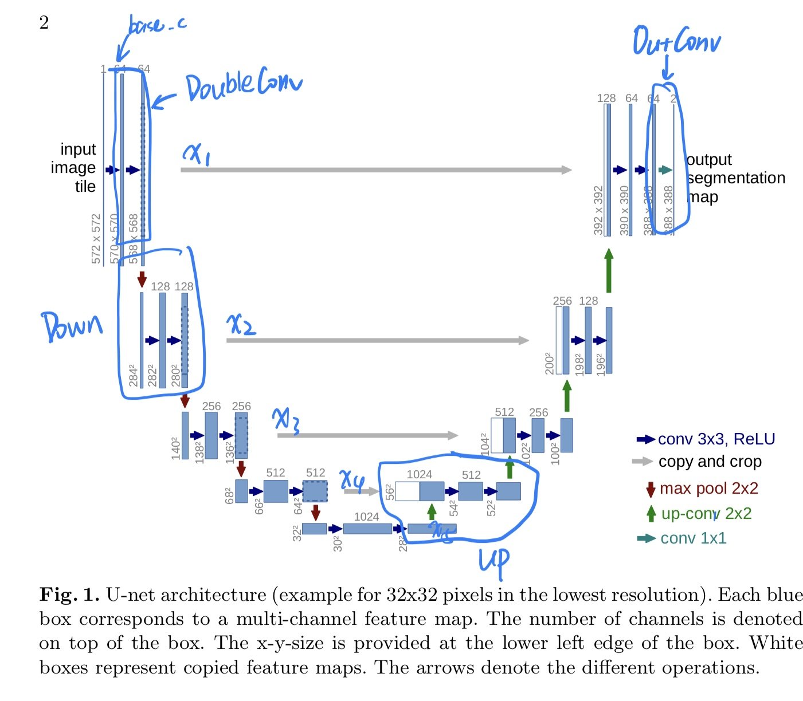

将Unet model划分为四个主要组件：

* DoubleConv：两层卷积

  ```python
  class DoubleConv(nn.Module):
      """(convolution => [BN] => ReLU) * 2"""
  
      def __init__(self, in_channels, out_channels, mid_channels=None):
          super().__init__()
          if not mid_channels:
              mid_channels = out_channels
          self.double_conv = nn.Sequential(
              nn.Conv2d(in_channels, mid_channels, kernel_size=3, padding=1, bias=False),
              nn.BatchNorm2d(mid_channels),
              nn.ReLU(inplace=True),
              nn.Conv2d(mid_channels, out_channels, kernel_size=3, padding=1, bias=False),
              nn.BatchNorm2d(out_channels),
              nn.ReLU(inplace=True)
          )
  
      def forward(self, x):
          return self.double_conv(x)
  ```

* Down：下采样+两层卷积

  ```python
  class Down(nn.Module):
      """Downscaling with maxpool then double conv"""
  
      def __init__(self, in_channels, out_channels):
          super().__init__()
          self.maxpool_conv = nn.Sequential(
              nn.MaxPool2d(2),
              DoubleConv(in_channels, out_channels)
          )
  
      def forward(self, x):
          return self.maxpool_conv(x)
  ```

* Up：上采样（默认使用双线性插值法）+拼接+两层卷积

  双线性插值法原理参考：[数学(4) 双线性插值(Bilinear Upsampling)_GZHermit的博客-CSDN博客_bilinear upsampling](https://blog.csdn.net/GZHermit/article/details/75261713)

  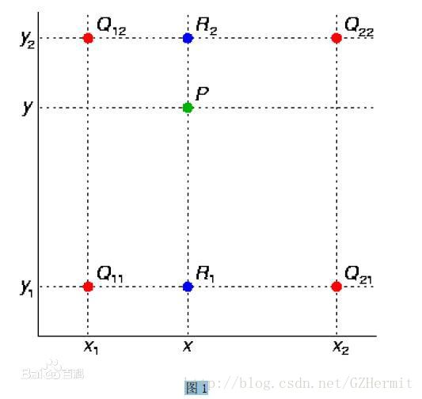

  对应位于同一条直线上的两点，如Q_12和Q_22，y值相同，因此忽略y值带来的影响，将两点的像素值视为y值，通过线性插值法可以得到R_2点的像素值，同理得到R_1点的像素值。接着再次运用线性插值得到目标点P的像素值。

  

  计算的矩阵形式如下：

  

  ```python
  class Up(nn.Module):
      """Upscaling then double conv"""
  
      def __init__(self, in_channels, out_channels, bilinear=True):
          super().__init__()
  
          # if bilinear, use the normal convolutions to reduce the number of channels
          if bilinear:
              self.up = nn.Upsample(scale_factor=2, mode='bilinear', align_corners=True)  #proportionally align the output and input pixels
              self.conv = DoubleConv(in_channels, out_channels, in_channels // 2)
          else:
              self.up = nn.ConvTranspose2d(in_channels, in_channels // 2, kernel_size=2, stride=2)
              self.conv = DoubleConv(in_channels, out_channels)
  
      def forward(self, x1, x2):
          x1 = self.up(x1)
          # input is CHW
          diffY = x2.size()[2] - x1.size()[2]
          diffX = x2.size()[3] - x1.size()[3]
  
          x1 = F.pad(x1, [diffX // 2, diffX - diffX // 2,
                          diffY // 2, diffY - diffY // 2])
          # if you have padding issues, see
          # https://github.com/HaiyongJiang/U-Net-Pytorch-Unstructured-Buggy/commit/0e854509c2cea854e247a9c615f175f76fbb2e3a
          # https://github.com/xiaopeng-liao/Pytorch-UNet/commit/8ebac70e633bac59fc22bb5195e513d5832fb3bd
          x = torch.cat([x2, x1], dim=1)
          return self.conv(x)
  ```

* OutConv：1X1卷积将输出通道变为类别数

  ```python
  class OutConv(nn.Module):
      def __init__(self, in_channels, out_channels):
          super(OutConv, self).__init__()
          self.conv = nn.Conv2d(in_channels, out_channels, kernel_size=1)
  
      def forward(self, x):
          return self.conv(x)
  ```

由这四个组件可构成完整的Unet网络：

```python
class Unet(nn.Module):
    def __init__(self, n_channels, n_classes, bilinear=False, base_c=64):
        super(Unet, self).__init__()
        self.n_channels = n_channels
        self.n_classes = n_classes
        self.bilinear = bilinear

        self.inc = DoubleConv(n_channels, base_c)
        self.down1 = Down(base_c, base_c * 2)
        self.down2 = Down(base_c * 2, base_c * 4)
        self.down3 = Down(base_c * 4, base_c * 8)
        factor = 2 if bilinear else 1
        self.down4 = Down(base_c * 8, base_c * 16 // factor)
        self.up1 = Up(base_c * 16, base_c * 8 // factor, bilinear)
        self.up2 = Up(base_c * 8, base_c * 4 // factor, bilinear)
        self.up3 = Up(base_c * 4, base_c * 2 // factor, bilinear)
        self.up4 = Up(base_c * 2, base_c, bilinear)
        self.outc = OutConv(base_c, n_classes)

    def forward(self, x):
        x1 = self.inc(x)
        x2 = self.down1(x1)
        x3 = self.down2(x2)
        x4 = self.down3(x3)
        x5 = self.down4(x4)
        x = self.up1(x5, x4)
        x = self.up2(x, x3)
        x = self.up3(x, x2)
        x = self.up4(x, x1)
        logits = self.outc(x)
        return logits
```

### Loss

Code中的Loss为dice loss，额外的评价指标为mIOU。

#### Dice loss

参考： [图像分割必备知识点 | Dice损失 理论+代码](https://blog.csdn.net/qq_34107425/article/details/110119894)


其中X、Y分别为ground_truth（label经过one-hot编码后的每个类别对应通道的map，每个像素点为0或1）和预测结果经过softmax后每个类别对应通道的map（每个像素点为[0,1]）。具体运算方法如下：

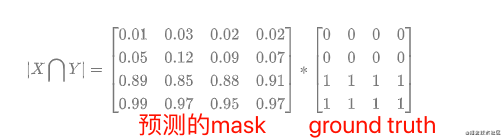

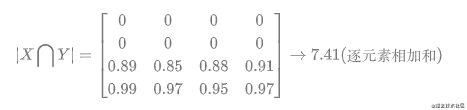

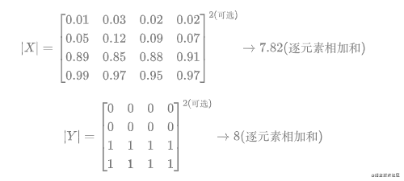

对于Dice_loss分子部分可视为2*TP，分母则为TP+TN+FP+FN，对应的代码实现如下：

```python
def Dice_Loss(inputs,target,beta=1,smooth=1e-5):
    n, c, h, w = inputs.size()
    nt,ht, wt,ct = target.size()

    temp_inputs = torch.softmax(inputs.permute(0,2,3,1).contiguous().view(n, -1, c), -1)   #对channel维度进行softmax
    temp_target = target.view(n, -1,ct)
    
    tp = torch.sum(temp_target*temp_inputs, axis=[0, 1])   
    fp = torch.sum(temp_inputs,axis=[0,1]) - tp
    fn = torch.sum(temp_target,axis=[0,1]) - tp

    score = ((1 + beta ** 2) * tp + smooth) / ((1 + beta ** 2) * tp + beta ** 2 * fn + fp + smooth)  #加入beta smooth
    dice_loss = 1 - torch.mean(score)
    return dice_loss
```

#### CE loss

[CrossEntropyLoss — PyTorch 1.11.0 documentation](https://pytorch.org/docs/stable/generated/torch.nn.CrossEntropyLoss.html)


```python
def CE_Loss(inputs, target):
    n, c, h, w = inputs.size()
    nt,ht, wt = target.size()
    assert h==ht and w==wt, "output shape error"

    CE_loss  = nn.CrossEntropyLoss()(inputs, target.long())
    return CE_loss
```

#### mIoU

对于IoU如下图所示：

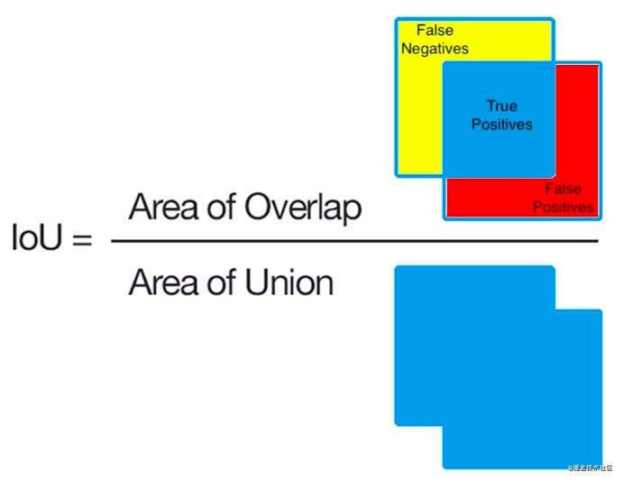

直观的理解如下图：

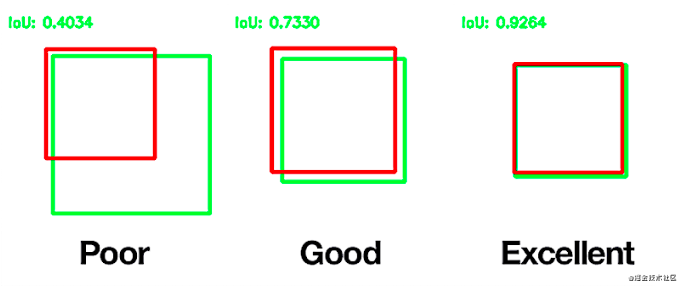

Dice loss和IoU的关系如下：


计算方法如下：

```python
def mIoU(inputs,target,smooth = 1e-5):
    n, c, h, w = inputs.size()
    nt, ht, wt, ct = target.size()
    assert h==ht and w==wt, "output shape error"
    
    temp_inputs = torch.softmax(inputs.permute(0,2,3,1).contiguous().view(n, -1, c), -1)
    temp_target = target.view(nt, -1,ct)
    
    tp = torch.sum(temp_target*temp_inputs, axis=[0, 1])   #每个值对应一个通道
    fp = torch.sum(temp_inputs,axis=[0,1]) - tp
    fn = torch.sum(temp_target,axis=[0,1]) - tp


    score = (tp + smooth)/(tp + fn + fp + smooth)
    return torch.mean(score)
```

### Implementation

```python
optimizer = torch.optim.Adam(net.parameters(),lr=1e-2)
lr_scheduler = torch.optim.lr_scheduler.StepLR(optimizer,step_size=10,gamma=0.1)
```


## Result

使用Adam优化，初始学习率为0.01，每5epochs学习率乘0.1

* 当loss只包含Dice loss时，val loss 和 mIoU如下图所示：

<center class='half'>
    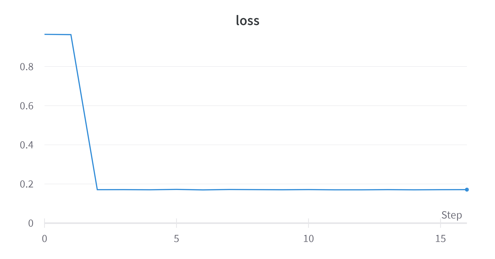
    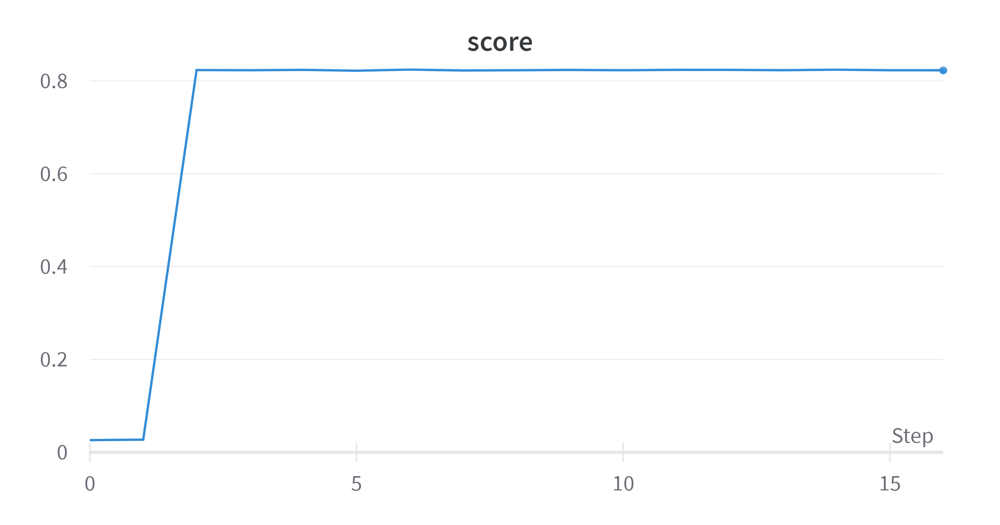
</center>

结果的mIoU可以达到0.8以上，但实际预测中效果并不好：

​					mIoU:0.8236164450645447

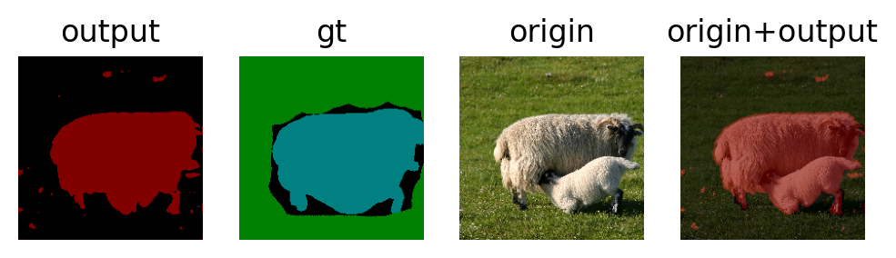

* 当总loss为Dice loss和CE loss的和时：

  <center class='half'>
      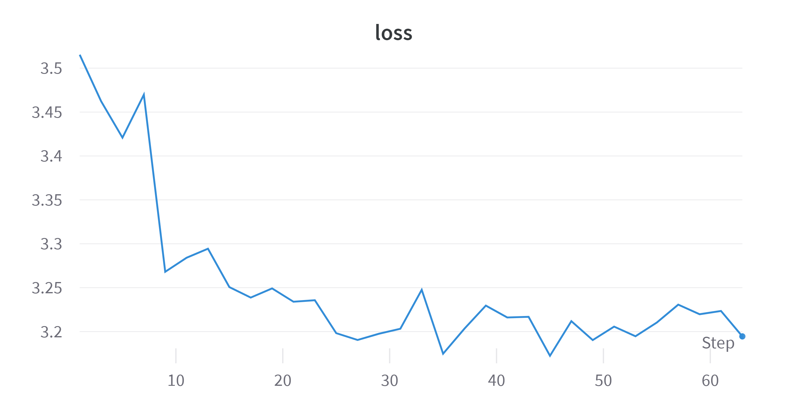
      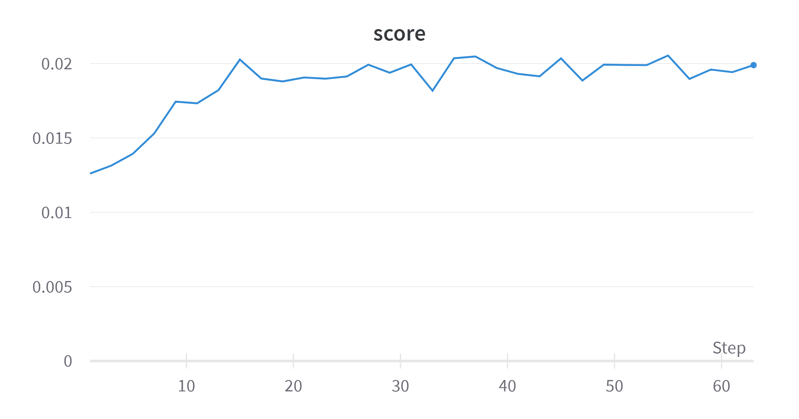
  </center>

结果的mIoU很低，但部分图片的预测结果较好：

​						mIoU:0.03525532782077789

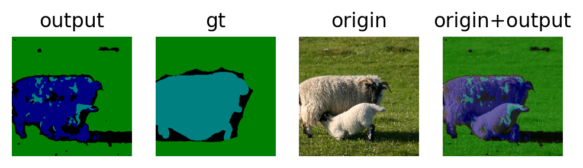

在上面的output中，绿色属于草地，浅蓝色属于羊，而深蓝色属于牛，此处将羊大面积划分成了牛，还算合理。但mIoU很低。

在其余许多样本中表现很差：

​					mIoU:0.013117403723299503

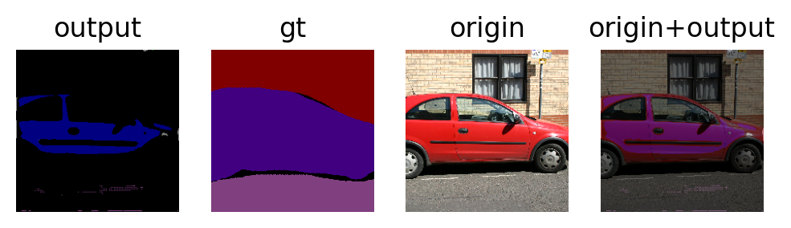


## Reference

* [[1505.04597v1\] U-Net: Convolutional Networks for Biomedical Image Segmentation (arxiv.org)](https://arxiv.org/abs/1505.04597v1)

* [13.9. 语义分割和数据集 — 动手学深度学习 2.0.0-beta0 documentation (d2l.ai)](https://zh.d2l.ai/chapter_computer-vision/semantic-segmentation-and-dataset.html)

* [milesial/Pytorch-UNet: PyTorch implementation of the U-Net for image semantic segmentation with high quality images (github.com)](https://github.com/milesial/Pytorch-UNet)
* [GuoPingPan/DeepLearing-Unet-SRCNN: The project is aiming to use Unet to deal with MSRCv2 Dataset and SRCNN to deal with BSDS500. (github.com)](https://github.com/GuoPingPan/DeepLearing-Unet-SRCNN)
* [数学(4) 双线性插值(Bilinear Upsampling)_GZHermit的博客-CSDN博客_bilinear upsampling](https://blog.csdn.net/GZHermit/article/details/75261713)
* [图像分割必备知识点 | Dice损失 理论+代码](https://blog.csdn.net/qq_34107425/article/details/110119894)
* [学习笔记\]lr_scheduler用法总结 - 知乎 (zhihu.com)](https://zhuanlan.zhihu.com/p/380795956)
* [论文笔记：图像数据增强之弹性形变（Elastic Distortions） - 知乎 (zhihu.com)](https://zhuanlan.zhihu.com/p/46833956)

